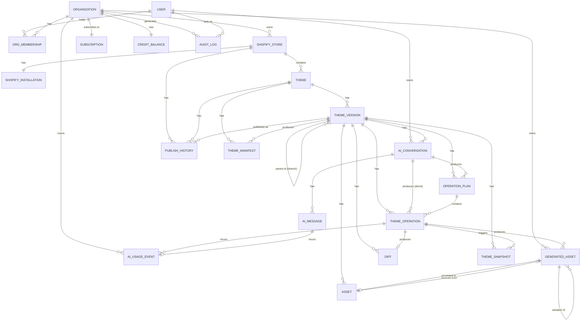

# 17. Database Model

This document defines the persisted data model backing Shopforge. It covers every entity named in the architecture core (§5): purpose, key fields, relationships, and indexing/uniqueness constraints. It closes with a design review of entities that were considered for consolidation, and an ER diagram of the full graph.

Conventions used below:
- All primary keys are `id` (UUID) unless noted otherwise.
- `belongs_to` / `has_many` / `has_one` describe logical foreign-key relationships, not a specific ORM.
- JSON columns store structures already defined in the architecture core (`ThemeManifest`, `ThemeModel`, `Operation`, `Diff`, `DiffEntry`) — this doc does not redefine those shapes, only how they're persisted.
- "Optimistic lock" fields and their protocol are specified fully in doc 18; this doc only declares the column.

---

## 1. User

**Purpose:** Represents a human account, independent of any single Shopify shop or Organization, because one person routinely belongs to multiple Organizations (e.g. an agency contractor) and Organizations must have members whose identity outlives any one store connection.

| Field | Type | Notes |
|---|---|---|
| id | uuid (pk) | |
| email | string | |
| name | string | |
| passwordHash | string, nullable | null when auth is via external OAuth provider only |
| authProvider | enum(`email`,`google`,`shopify`) | |
| avatarUrl | string, nullable | |
| createdAt | timestamp | |
| updatedAt | timestamp | |
| lastLoginAt | timestamp, nullable | |

**Relationships**
- User `has_many` OrgMembership
- User `has_many` Organization (through OrgMembership)
- User `has_many` AIConversation (as initiator)
- User `has_many` AuditLog (as actor)

**Indexes/constraints:** unique(`email`).

---

## 2. Organization

**Purpose:** The billing and access-control boundary. Needed because agencies/teams manage multiple Shopify stores under one subscription and one shared set of members with roles — Organization is the unit `Subscription` and `CreditBalance` attach to, not the individual store.

| Field | Type | Notes |
|---|---|---|
| id | uuid (pk) | |
| name | string | |
| slug | string | url-safe, used in routing |
| ownerUserId | uuid (fk User) | denormalized pointer to the member with role=`owner`, for O(1) lookup |
| status | enum(`active`,`trial`,`suspended`) | |
| createdAt | timestamp | |
| updatedAt | timestamp | |

**Relationships**
- Organization `has_many` OrgMembership
- Organization `has_many` ShopifyStore
- Organization `has_one` Subscription
- Organization `has_one` CreditBalance
- Organization `has_many` AIUsageEvent
- Organization `has_many` AuditLog
- Organization `has_many` GeneratedAsset

**Indexes/constraints:** unique(`slug`).

---

## 3. OrgMembership

**Purpose:** Join entity carrying the role (`owner`/`admin`/`editor`/`viewer`) that a User holds within an Organization. Required because Shopforge's entire permission model (doc 18) is role-based per-organization, not global per-user.

| Field | Type | Notes |
|---|---|---|
| id | uuid (pk) | |
| organizationId | uuid (fk Organization) | |
| userId | uuid (fk User) | |
| role | enum(`owner`,`admin`,`editor`,`viewer`) | see doc 18 §Roles |
| status | enum(`active`,`invited`,`revoked`) | |
| invitedByUserId | uuid (fk User), nullable | |
| createdAt | timestamp | |
| updatedAt | timestamp | |

**Relationships**
- OrgMembership `belongs_to` Organization
- OrgMembership `belongs_to` User

**Indexes/constraints:** unique(`organizationId`, `userId`) — a user holds exactly one role per org. Exactly one `active` membership with role=`owner` per Organization is enforced at the application layer (ownership transfer is a transaction, never a gap).

---

## 4. ShopifyStore

**Purpose:** Represents one connected Shopify shop (a `myshopify.com` domain). This is the unit OAuth installation, theme ownership, and publish targets are scoped to — an Organization can own several.

| Field | Type | Notes |
|---|---|---|
| id | uuid (pk) | |
| organizationId | uuid (fk Organization) | |
| shopDomain | string | e.g. `foo.myshopify.com` |
| shopifyShopId | string | Shopify's own shop id/GID |
| planName | string, nullable | Shopify's merchant plan, informational only |
| currency | string | |
| timezone | string | |
| status | enum(`active`,`disconnected`,`uninstalled`) | |
| connectedAt | timestamp | |

**Relationships**
- ShopifyStore `belongs_to` Organization
- ShopifyStore `has_one` ShopifyInstallation
- ShopifyStore `has_many` Theme
- ShopifyStore `has_many` PublishHistory

**Indexes/constraints:** unique(`shopDomain`).

---

## 5. ShopifyInstallation

**Purpose:** Holds OAuth access token/scopes for a store. Kept as a separate entity from ShopifyStore — not columns on it — so that token material (which needs encryption-at-rest and tighter read access) can be governed independently of the store record, and so uninstall/reinstall cycles don't churn the store's own history.

| Field | Type | Notes |
|---|---|---|
| id | uuid (pk) | |
| shopifyStoreId | uuid (fk ShopifyStore) | |
| accessToken | string, encrypted at rest | |
| scopes | string[] | |
| apiVersion | string | Shopify Admin API version pinned at install time |
| webhookIds | string[] | registered webhook subscription ids |
| isActive | boolean | |
| installedAt | timestamp | |
| uninstalledAt | timestamp, nullable | |

**Relationships**
- ShopifyInstallation `belongs_to` ShopifyStore (1:1)

**Indexes/constraints:** unique(`shopifyStoreId`).

---

## 6. Theme

**Purpose:** Represents one distinct Shopify theme within a store — Shopify stores can hold several themes at once (main, unpublished, development, demo), and each needs its own independent version history.

| Field | Type | Notes |
|---|---|---|
| id | uuid (pk) | |
| shopifyStoreId | uuid (fk ShopifyStore) | |
| shopifyThemeId | string | Shopify's theme id |
| name | string | |
| role | enum(`main`,`unpublished`,`development`,`demo`) | mirrors `ThemeManifest.shopifyRole` |
| currentThemeVersionId | uuid (fk ThemeVersion), nullable | pointer to the active working copy |
| lastParsedAt | timestamp, nullable | |
| createdAt | timestamp | |
| updatedAt | timestamp | |

**Relationships**
- Theme `belongs_to` ShopifyStore
- Theme `has_many` ThemeVersion
- Theme `has_many` ThemeManifest
- Theme `has_many` PublishHistory

**Indexes/constraints:** unique(`shopifyStoreId`, `shopifyThemeId`).

---

## 7. ThemeVersion

**Purpose:** The mutable working-copy unit that both the visual editor and the AI operate against (Principle 7). Every edit session needs a durable, checkpoint-able identity so undo, branching, and concurrent-write arbitration all have something concrete to anchor to.

| Field | Type | Notes |
|---|---|---|
| id | uuid (pk) | |
| themeId | uuid (fk Theme) | |
| parentThemeVersionId | uuid (fk ThemeVersion), nullable | self-referential, branch lineage |
| label | string | e.g. "v14", "AI session Aug 19" |
| status | enum(`draft`,`active`,`archived`,`published`) | |
| themeModel | json | serialized `ThemeModel` (architecture core §2) |
| themeVersionHash | string | content hash, cache/dedup key |
| lockVersion | integer, default 0 | optimistic-concurrency counter, see doc 18 |
| createdByUserId | uuid (fk User) | |
| publishedAt | timestamp, nullable | |
| createdAt | timestamp | |
| updatedAt | timestamp | |

**Relationships**
- ThemeVersion `belongs_to` Theme
- ThemeVersion `belongs_to` ThemeVersion (parent, self-referential)
- ThemeVersion `has_many` ThemeOperation
- ThemeVersion `has_many` OperationPlan
- ThemeVersion `has_many` Diff
- ThemeVersion `has_many` ThemeSnapshot
- ThemeVersion `has_many` AIConversation
- ThemeVersion `has_many` Asset
- ThemeVersion `has_many` PublishHistory (as the version that was published)

**Indexes/constraints:**
- index(`themeId`, `status`)
- **unique partial index** on `themeId` WHERE `status = 'active'` — enforces exactly one active ThemeVersion per Theme
- index(`lockVersion`) is implicit in the compare-and-swap update clause used by every mutation (doc 18)

---

## 8. ThemeManifest

**Purpose:** Persists the derived, regenerable summary defined in architecture core §1, so reads (editor load, AI context building) don't require re-parsing theme files on every request, and so re-syncs can diff against the prior manifest by `themeVersionHash`.

| Field | Type | Notes |
|---|---|---|
| id | uuid (pk) | |
| themeId | uuid (fk Theme) | |
| themeVersionId | uuid (fk ThemeVersion), nullable | the version whose serialized files produced this parse, if applicable |
| shopifyThemeId | string | |
| themeName | string | |
| shopifyRole | enum(`main`,`unpublished`,`development`,`demo`) | |
| themeVersionHash | string | matches ThemeManifest.themeVersionHash from §1 |
| manifestJson | json | full `ThemeManifest` shape from §1 |
| parsedAt | timestamp | |
| createdAt | timestamp | |

**Relationships**
- ThemeManifest `belongs_to` Theme
- ThemeManifest `belongs_to` ThemeVersion (nullable)

**Indexes/constraints:**
- index(`themeId`, `parsedAt` desc) — fetch latest manifest for a theme
- unique(`themeId`, `themeVersionHash`) — avoids storing duplicate cache entries when a re-parse produces identical content

---

## 9. ThemeSnapshot

**Purpose:** A full file-tree backup taken automatically immediately before any destructive or generative operation (and optionally before publish), independent of the Diff undo log. Diffs guarantee model-level reversibility, but generative ops (`modify_liquid`, `create_section_file`) touch raw code the model layer doesn't fully own — a snapshot is the belt-and-suspenders raw-file safety net required by Principle 6.

| Field | Type | Notes |
|---|---|---|
| id | uuid (pk) | |
| themeVersionId | uuid (fk ThemeVersion) | |
| reason | enum(`pre_destructive_op`,`pre_publish`,`manual`,`scheduled`) | |
| triggeredByOperationId | uuid (fk ThemeOperation), nullable | |
| fileTreeArchiveUrl | string | blob storage pointer (e.g. S3 tarball) |
| fileCount | integer | |
| sizeBytes | integer | |
| createdByUserId | uuid (fk User), nullable | null when system-triggered |
| createdAt | timestamp | |

**Relationships**
- ThemeSnapshot `belongs_to` ThemeVersion
- ThemeSnapshot `belongs_to` ThemeOperation (nullable, the op that triggered it)

**Indexes/constraints:** index(`themeVersionId`, `createdAt` desc).

---

## 10. ThemeOperation

**Purpose:** The persisted form of `Operation` (architecture core §3) after it has been proposed or applied. This is the audit trail of exactly which structural or generative change was made, needed for undo, per-operation cost accounting, and plan progress tracking. Kept distinct from Diff: ThemeOperation is the *intent* (what was requested), Diff is the *effect* (what actually changed) — an operation can fail before producing a diff, and a Diff can also originate from a direct editor edit that was never modeled as an Operation.

| Field | Type | Notes |
|---|---|---|
| id (opId) | uuid (pk) | |
| themeVersionId | uuid (fk ThemeVersion) | |
| operationPlanId | uuid (fk OperationPlan), nullable | null for direct (non-planned) editor-triggered structural ops |
| aiConversationId | uuid (fk AIConversation), nullable | |
| type | enum, see architecture core §3 `OperationType` | |
| target | json | `{ templateKey?, instanceId?, blockInstanceId?, settingId?, assetFile? }` |
| payload | json | shape depends on `type` |
| requiresNewCode | boolean | |
| riskLevel | enum(`safe`,`review`,`destructive`) | |
| estimatedCreditCost | decimal | |
| actualCreditCost | decimal, nullable | set once executed |
| status | enum(`pending`,`executing`,`applied`,`failed`,`reverted`) | |
| executedByUserId | uuid (fk User), nullable | set for editor-originated ops |
| createdAt | timestamp | |
| appliedAt | timestamp, nullable | |
| revertedAt | timestamp, nullable | |

**Relationships**
- ThemeOperation `belongs_to` ThemeVersion
- ThemeOperation `belongs_to` OperationPlan (nullable)
- ThemeOperation `belongs_to` AIConversation (nullable)
- ThemeOperation `has_one` Diff
- ThemeOperation `has_many` ThemeSnapshot (triggered)
- ThemeOperation `has_many` AIUsageEvent

**Indexes/constraints:** index(`themeVersionId`, `createdAt`); index(`operationPlanId`).

---

## 11. OperationPlan

**Purpose:** The persisted form of an Operation Plan (architecture core §3) — an ordered set of Operations with rationale and an overall risk summary, generated by the Planner before any non-trivial execution (Principle 5). Persisting it as its own entity (rather than embedding on AIConversation) is what lets a user review/approve/reject the plan as one unit, and lets one conversation produce several plans across turns.

| Field | Type | Notes |
|---|---|---|
| id | uuid (pk) | |
| themeVersionId | uuid (fk ThemeVersion) | |
| aiConversationId | uuid (fk AIConversation) | |
| rationale | text | natural-language overall summary |
| overallRiskLevel | enum(`safe`,`review`,`destructive`) | |
| estimatedTotalCreditCost | decimal | |
| status | enum(`proposed`,`approved`,`rejected`,`partially_executed`,`executed`,`expired`) | |
| respondedByUserId | uuid (fk User), nullable | |
| respondedAt | timestamp, nullable | |
| createdAt | timestamp | |

**Relationships**
- OperationPlan `belongs_to` ThemeVersion
- OperationPlan `belongs_to` AIConversation
- OperationPlan `has_many` ThemeOperation (ordered)

**Indexes/constraints:** index(`themeVersionId`, `status`); index(`aiConversationId`).

---

## 12. Diff

**Purpose:** As defined in architecture core §4 — the reversible, human-readable record of what changed in the ThemeModel as a result of one operation or one manual edit. Storing `before` on every entry is what makes single-operation undo possible without a full snapshot restore.

| Field | Type | Notes |
|---|---|---|
| id (diffId) | uuid (pk) | |
| themeVersionId | uuid (fk ThemeVersion) | |
| causedByType | enum(`ai_operation`,`editor_edit`) | |
| causedByOperationId | uuid (fk ThemeOperation), nullable | set when `causedByType = ai_operation` |
| causedByUserId | uuid (fk User), nullable | |
| entries | json (`DiffEntry[]`) | `{ kind, path, before?, after?, humanSummary }` |
| createdAt | timestamp | |

**Relationships**
- Diff `belongs_to` ThemeVersion
- Diff `belongs_to` ThemeOperation (nullable)
- Diff `belongs_to` User (nullable)

**Indexes/constraints:** index(`themeVersionId`, `createdAt`) — the chronological undo stack for a version.

---

## 13. AIConversation

**Purpose:** Groups a sequence of AIMessages and the OperationPlans/ThemeOperations they produce into one chat thread scoped to a ThemeVersion. Needed to give the AI multi-turn context and to give users a browsable history of "what did I ask the AI to do to this theme."

| Field | Type | Notes |
|---|---|---|
| id | uuid (pk) | |
| themeVersionId | uuid (fk ThemeVersion) | |
| userId | uuid (fk User) | who started it |
| title | string | auto-summarized or user-set |
| status | enum(`active`,`archived`) | |
| lastMessageAt | timestamp | |
| createdAt | timestamp | |
| updatedAt | timestamp | |

**Relationships**
- AIConversation `belongs_to` ThemeVersion
- AIConversation `belongs_to` User
- AIConversation `has_many` AIMessage
- AIConversation `has_many` OperationPlan
- AIConversation `has_many` ThemeOperation (direct, non-planned)

**Indexes/constraints:** index(`themeVersionId`, `updatedAt` desc).

---

## 14. AIMessage

**Purpose:** One turn (user prompt or assistant response) within an AIConversation. Kept separate from OperationPlan/ThemeOperation because most messages don't produce an operation — clarifying questions, capability-gap explanations, and chit-chat are all messages without an operation.

| Field | Type | Notes |
|---|---|---|
| id | uuid (pk) | |
| aiConversationId | uuid (fk AIConversation) | |
| role | enum(`user`,`assistant`,`system`) | |
| content | text | markdown-capable |
| attachments | json, nullable | e.g. referenced image URLs |
| relatedOperationPlanId | uuid (fk OperationPlan), nullable | |
| relatedAIUsageEventId | uuid (fk AIUsageEvent), nullable | |
| createdAt | timestamp | |

**Relationships**
- AIMessage `belongs_to` AIConversation
- AIMessage `belongs_to` OperationPlan (nullable)
- AIMessage `has_one` AIUsageEvent (nullable)

**Indexes/constraints:** index(`aiConversationId`, `createdAt`).

---

## 15. AIUsageEvent

**Purpose:** An immutable credit-ledger line item for every billable AI action (chat completion, plan generation, operation execution, image/copy generation). Kept separate from the mutable `CreditBalance` running total for auditability — the ledger must never be edited in place, only appended to, so invoices and disputes have a source of truth.

| Field | Type | Notes |
|---|---|---|
| id | uuid (pk) | |
| organizationId | uuid (fk Organization) | |
| shopifyStoreId | uuid (fk ShopifyStore), nullable | |
| themeVersionId | uuid (fk ThemeVersion), nullable | |
| aiConversationId | uuid (fk AIConversation), nullable | |
| aiMessageId | uuid (fk AIMessage), nullable | |
| operationId | uuid (fk ThemeOperation), nullable | |
| eventType | enum(`chat_message`,`plan_generation`,`operation_execution`,`generate_image`,`generate_copy`,`analyze`) | |
| creditsCost | decimal | |
| tokensInput | integer, nullable | |
| tokensOutput | integer, nullable | |
| modelUsed | string, nullable | |
| createdAt | timestamp | |

**Relationships**
- AIUsageEvent `belongs_to` Organization
- AIUsageEvent `belongs_to` ShopifyStore / ThemeVersion / AIConversation / AIMessage / ThemeOperation (all nullable, whichever triggered it)

**Indexes/constraints:** index(`organizationId`, `createdAt`) — billing-period rollups; index(`eventType`).

---

## 16. GeneratedAsset

**Purpose:** Tracks AI-generated media (image or copy) with its generation provenance — prompt, model, source operation — separately from `Asset`, which is the generic theme file-asset record. This keeps unaccepted/discarded generation attempts (and regeneration variations) out of the theme's canonical asset library.

| Field | Type | Notes |
|---|---|---|
| id | uuid (pk) | |
| organizationId | uuid (fk Organization) | |
| themeVersionId | uuid (fk ThemeVersion), nullable | |
| operationId | uuid (fk ThemeOperation), nullable | |
| sourceGeneratedAssetId | uuid (fk GeneratedAsset), nullable | self-ref, for regenerate/variation chains |
| assetId | uuid (fk Asset), nullable | set once promoted into the theme's asset library |
| type | enum(`image`,`copy`) | |
| prompt | text | |
| modelUsed | string | |
| status | enum(`generated`,`accepted`,`discarded`) | |
| createdByUserId | uuid (fk User) | |
| createdAt | timestamp | |

**Relationships**
- GeneratedAsset `belongs_to` Organization
- GeneratedAsset `belongs_to` ThemeVersion (nullable)
- GeneratedAsset `belongs_to` ThemeOperation (nullable)
- GeneratedAsset `belongs_to` Asset (nullable, once promoted)
- GeneratedAsset `belongs_to` GeneratedAsset (nullable, variation lineage)

**Indexes/constraints:** index(`themeVersionId`, `createdAt`).

---

## 17. Asset

**Purpose:** The canonical, DB-queryable record of a theme file-level asset (image, font, css, js, other), mirroring `ThemeModel.AssetRef` / `ThemeManifest.assets`. It's a separate table (not just the in-model JSON reference) because the asset library UI, dedup-by-checksum, and storage size accounting all need to query assets independently of loading the full ThemeModel.

| Field | Type | Notes |
|---|---|---|
| id | uuid (pk) | |
| themeVersionId | uuid (fk ThemeVersion) | |
| file | string | path within the theme, e.g. `assets/hero.jpg` |
| type | enum(`css`,`js`,`image`,`font`,`other`) | |
| url | string | storage location |
| sizeBytes | integer | |
| uploadedBy | enum(`user`,`ai`,`theme-default`) | |
| sourceGeneratedAssetId | uuid (fk GeneratedAsset), nullable | |
| checksum | string | |
| createdAt | timestamp | |
| updatedAt | timestamp | |

**Relationships**
- Asset `belongs_to` ThemeVersion
- Asset `belongs_to` GeneratedAsset (nullable)

**Indexes/constraints:** unique(`themeVersionId`, `file`); index(`checksum`) for dedup.

---

## 18. PublishHistory

**Purpose:** Audit and rollback record of every time a ThemeVersion's serialized files were pushed to Shopify as the live/main theme (or updated on an unpublished/dev theme). This is what backs `/shopify/publish` and `/shopify/rollback` and answers "what's live right now, and what was live before."

| Field | Type | Notes |
|---|---|---|
| id | uuid (pk) | |
| shopifyStoreId | uuid (fk ShopifyStore) | |
| themeId | uuid (fk Theme) | |
| themeVersionId | uuid (fk ThemeVersion) | the version published |
| previousThemeVersionId | uuid (fk ThemeVersion), nullable | rollback target reference |
| shopifyThemeId | string | |
| action | enum(`publish`,`rollback`,`preview_push`) | |
| status | enum(`pending`,`success`,`failed`) | |
| publishedByUserId | uuid (fk User) | |
| startedAt | timestamp | |
| completedAt | timestamp, nullable | |
| errorMessage | string, nullable | |

**Relationships**
- PublishHistory `belongs_to` ShopifyStore
- PublishHistory `belongs_to` Theme
- PublishHistory `belongs_to` ThemeVersion (published, and previous)

**Indexes/constraints:** index(`shopifyStoreId`, `startedAt` desc); index(`themeId`, `startedAt` desc).

---

## 19. AuditLog

**Purpose:** A generic, append-only security/compliance trail of sensitive actions across the whole system (auth events, role changes, OAuth install/uninstall, publishes, destructive operations), independent of any single domain table. Required by Principle 10 (security first — imported data is untrusted) and needed for incident investigation.

| Field | Type | Notes |
|---|---|---|
| id | uuid (pk) | |
| organizationId | uuid (fk Organization), nullable | null for platform-level events |
| actorUserId | uuid (fk User), nullable | null for system/AI actions |
| actorType | enum(`user`,`system`,`ai`) | |
| action | string | e.g. `org.member.role_changed`, `shopify.oauth.connected`, `theme.published` |
| targetType | string | e.g. `ShopifyStore` |
| targetId | string | |
| metadata | json | |
| ipAddress | string, nullable | |
| createdAt | timestamp | |

**Relationships**
- AuditLog `belongs_to` Organization (nullable)
- AuditLog `belongs_to` User (nullable, actor)

**Indexes/constraints:** index(`organizationId`, `createdAt` desc); index(`actorUserId`, `createdAt` desc); index(`targetType`, `targetId`).

---

## 20. Subscription (Plan/Subscription)

**Purpose:** The billing plan an Organization is subscribed to — tier, monthly credit allotment, price. The canonical name list writes this as "Plan/Subscription"; treated here as **one** entity (`Subscription`, with a `planTier` field), not two — see the design note below.

| Field | Type | Notes |
|---|---|---|
| id | uuid (pk) | |
| organizationId | uuid (fk Organization) | |
| planTier | enum(`free`,`starter`,`pro`,`agency`) | |
| status | enum(`active`,`past_due`,`canceled`,`trialing`) | |
| monthlyCreditAllotment | integer | |
| pricePerMonth | decimal | |
| billingProvider | string | e.g. `stripe` |
| billingProviderCustomerId | string | |
| billingProviderSubscriptionId | string | |
| currentPeriodStart | timestamp | |
| currentPeriodEnd | timestamp | |
| cancelAtPeriodEnd | boolean | |
| createdAt | timestamp | |
| updatedAt | timestamp | |

**Relationships**
- Subscription `belongs_to` Organization (1:1)

**Indexes/constraints:** unique(`organizationId`) — one subscription record per org (historical plan changes are tracked via `billingProvider` events/webhooks, not new rows).

---

## 21. CreditBalance

**Purpose:** The Organization's current spendable AI-credit balance — a mutable running total kept separate from `AIUsageEvent` (the immutable ledger) so that a pre-flight "does this org have enough credit to run this operation" check is an O(1) row read instead of a `SUM()` over the ledger on every AI action.

| Field | Type | Notes |
|---|---|---|
| id | uuid (pk) | |
| organizationId | uuid (fk Organization) | |
| currentBalance | decimal | |
| lifetimeGranted | decimal | |
| lifetimeConsumed | decimal | |
| lastReplenishedAt | timestamp, nullable | |
| lastConsumedAt | timestamp, nullable | |
| updatedAt | timestamp | |

**Relationships**
- CreditBalance `belongs_to` Organization (1:1)

**Indexes/constraints:** unique(`organizationId`). `currentBalance` is updated transactionally alongside the `AIUsageEvent` insert that consumes it.

---

## Design review: entities considered for consolidation

The brief asked for an explicit judgment call on whether any entity is unnecessary or should be merged. Four were seriously considered; the conclusion for each:

**GeneratedAsset vs. Asset — kept separate.** The alternative is a single `Asset` table with nullable generation columns (`prompt`, `modelUsed`, `status`). Rejected because: (1) `Asset` has a `unique(themeVersionId, file)` constraint — it represents one file path in the theme — while a single generation request can produce several candidate images before one is accepted, which doesn't fit that constraint without a separate staging table; (2) discarded generations shouldn't appear in asset-library queries/UI at all, and filtering them out of every `Asset` query is more error-prone than never putting them there.

**"Plan/Subscription" — treated as one entity, not two.** The source name has a slash because it's one billing concept referred to by two common terms, not two entities. Modeled as a single `Subscription` table with a `planTier` enum. Introducing a separate `Plan` table (of tier definitions: name, price, credit allotment) is a reasonable future normalization if plan definitions need independent versioning, but is not required by anything in scope today, so it isn't split out.

**ThemeManifest vs. folding into Theme** — kept as its own table rather than columns on `Theme`. Re-syncing needs to diff the new parse against the *previous* manifest by `themeVersionHash` (architecture core §1), which requires retaining manifest history, not just a "latest" pointer. A single denormalized column on `Theme` would lose that history.

**ThemeOperation vs. Diff** — kept separate (addressed inline above under ThemeOperation) because they represent different things: requested intent vs. realized effect. An Operation can be `pending`/`failed` without ever producing a Diff; a Diff can exist from a manual editor edit that was never modeled as a ThemeOperation at all (`causedByType = editor_edit` with no `causedByOperationId`).

No entity from the canonical list was found to be truly unnecessary — each maps to a distinct read/write access pattern or a distinct lifecycle (proposal vs. execution, ledger vs. balance, intent vs. effect, working copy vs. backup).

---

## ER Diagram

