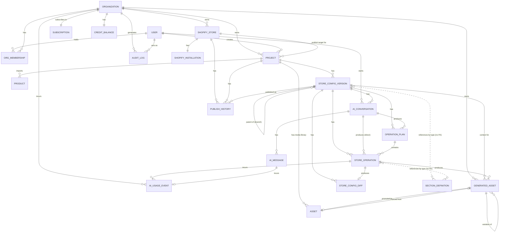

# 17. Database Model

This document defines the persisted data model backing Shopforge. It covers every entity named in the architecture core (§5): purpose, key fields, relationships, and indexing/uniqueness constraints. It closes with a design review of entities that were considered for consolidation, and an ER diagram of the full graph.

Conventions used below:
- All primary keys are `id` (UUID) unless noted otherwise.
- `belongs_to` / `has_many` / `has_one` describe logical foreign-key relationships, not a specific ORM.
- JSON columns store structures already defined elsewhere — the Store Configuration shape (doc 08), section settings/blocks schemas (doc 07), operation types (doc 11), and diff-entry shape (doc 14). This doc does not redefine those shapes, only how they're persisted.
- "Optimistic lock" fields and their protocol are specified fully in doc 18; this doc only declares the column.
- Two similarly-named entities appear in this model and must not be confused: **`ShopifyStore`** is a connected merchant `myshopify.com` shop (an OAuth install target). **`Project`** is a Shopforge-generated store project — it can exist, be edited, and be fully AI-generated long before any `ShopifyStore` is connected. Field and path names below always spell out `shopifyStoreId` vs `storeId` to keep the two unambiguous.

---

## 1. User

**Purpose:** Represents a human account, independent of any single Shopify shop or Organization, because one person routinely belongs to multiple Organizations (e.g. an agency contractor) and Organizations must have members whose identity outlives any one store connection.

| Field | Type | Notes |
|---|---|---|
| id | uuid (pk) | |
| email | string | |
| name | string | |
| passwordHash | string, nullable | null when auth is via external OAuth provider only |
| authProvider | enum(`email`,`google`,`shopify`) | |
| avatarUrl | string, nullable | |
| createdAt | timestamp | |
| updatedAt | timestamp | |
| lastLoginAt | timestamp, nullable | |

**Relationships**
- User `has_many` OrgMembership
- User `has_many` Organization (through OrgMembership)
- User `has_many` Project (as creator)
- User `has_many` AIConversation (as initiator)
- User `has_many` AuditLog (as actor)

**Indexes/constraints:** unique(`email`).

---

## 2. Organization

**Purpose:** The billing and access-control boundary. Needed because agencies/teams manage multiple Shopify stores and multiple generated store projects under one subscription and one shared set of members with roles — Organization is the unit `Subscription` and `CreditBalance` attach to, not the individual store.

| Field | Type | Notes |
|---|---|---|
| id | uuid (pk) | |
| name | string | |
| slug | string | url-safe, used in routing |
| ownerUserId | uuid (fk User) | denormalized pointer to the member with role=`owner`, for O(1) lookup |
| status | enum(`active`,`trial`,`suspended`) | |
| createdAt | timestamp | |
| updatedAt | timestamp | |

**Relationships**
- Organization `has_many` OrgMembership
- Organization `has_many` ShopifyStore
- Organization `has_many` Project
- Organization `has_one` Subscription
- Organization `has_one` CreditBalance
- Organization `has_many` AIUsageEvent
- Organization `has_many` AuditLog
- Organization `has_many` GeneratedAsset

**Indexes/constraints:** unique(`slug`).

---

## 3. OrgMembership

**Purpose:** Join entity carrying the role (`owner`/`admin`/`editor`/`viewer`) that a User holds within an Organization. Required because Shopforge's entire permission model (doc 18) is role-based per-organization, not global per-user.

| Field | Type | Notes |
|---|---|---|
| id | uuid (pk) | |
| organizationId | uuid (fk Organization) | |
| userId | uuid (fk User) | |
| role | enum(`owner`,`admin`,`editor`,`viewer`) | see doc 18 §Roles |
| status | enum(`active`,`invited`,`revoked`) | |
| invitedByUserId | uuid (fk User), nullable | |
| createdAt | timestamp | |
| updatedAt | timestamp | |

**Relationships**
- OrgMembership `belongs_to` Organization
- OrgMembership `belongs_to` User

**Indexes/constraints:** unique(`organizationId`, `userId`) — a user holds exactly one role per org. Exactly one `active` membership with role=`owner` per Organization is enforced at the application layer (ownership transfer is a transaction, never a gap).

---

## 4. ShopifyStore

**Purpose:** Represents one connected Shopify shop (a `myshopify.com` domain). This is the unit OAuth installation and publish targets are scoped to — an Organization can connect several, and a given generated `Project` (§7) is only linked to one once the user chooses to publish it.

| Field | Type | Notes |
|---|---|---|
| id | uuid (pk) | |
| organizationId | uuid (fk Organization) | |
| shopDomain | string | e.g. `foo.myshopify.com` |
| shopifyShopId | string | Shopify's own shop id/GID |
| planName | string, nullable | Shopify's merchant plan, informational only |
| currency | string | |
| timezone | string | |
| status | enum(`active`,`disconnected`,`uninstalled`) | |
| connectedAt | timestamp | |

**Relationships**
- ShopifyStore `belongs_to` Organization
- ShopifyStore `has_one` ShopifyInstallation
- ShopifyStore `has_many` Project (generated stores published or targeted at this shop)
- ShopifyStore `has_many` PublishHistory

**Indexes/constraints:** unique(`shopDomain`).

---

## 5. ShopifyInstallation

**Purpose:** Holds OAuth access token/scopes for a store, including the status of the `write_themes` App Store access-scope exemption that gates publishing (doc 16). Kept as a separate entity from ShopifyStore — not columns on it — so that token material (which needs encryption-at-rest and tighter read access) can be governed independently of the store record, and so uninstall/reinstall cycles don't churn the store's own history.

| Field | Type | Notes |
|---|---|---|
| id | uuid (pk) | |
| shopifyStoreId | uuid (fk ShopifyStore) | |
| accessToken | string, encrypted at rest | |
| scopes | string[] | |
| apiVersion | string | Shopify Admin API version pinned at install time |
| writeThemesExemptionStatus | enum(`not_requested`,`pending`,`granted`,`denied`) | required before any `themeCreate`/`themeFilesUpsert`/`themePublish` call (doc 16) |
| webhookIds | string[] | registered webhook subscription ids |
| isActive | boolean | |
| installedAt | timestamp | |
| uninstalledAt | timestamp, nullable | |

**Relationships**
- ShopifyInstallation `belongs_to` ShopifyStore (1:1)

**Indexes/constraints:** unique(`shopifyStoreId`).

---

## 6. Product

**Purpose:** The imported source-of-truth product data a Project is generated from — title, description, pricing, media, and variant structure pulled from the merchant-supplied product URL (Product URL → Product Import/Scraper → Product Data). Kept as a distinct entity from anything living in the Store Configuration, deliberately: `Product` holds ground-truth imported facts, while a Store Configuration's section content (headlines, marketing copy, imagery choices) is AI-generated/rewritten presentation built *from* those facts. Conflating the two would make it impossible to tell "what did we actually import" from "what did the AI decide to say about it" — which matters both for accuracy review and for re-running generation against the same source facts without re-scraping.

Import is a best-effort scrape against an arbitrary external page, so partial/failed outcomes are first-class, not exceptional: `importStatus` plus `importedFieldsMissing` capture "we got some but not all of it," and every content field below is nullable to allow that state.

| Field | Type | Notes |
|---|---|---|
| id | uuid (pk) | |
| projectId | uuid (fk Project) | |
| sourceUrl | string | the merchant-provided product page URL |
| sourcePlatform | enum(`shopify`,`woocommerce`,`bigcommerce`,`amazon`,`generic_html`,`unknown`), nullable | detected during scraping, informs which extraction strategy ran |
| importStatus | enum(`pending`,`importing`,`succeeded`,`partial`,`failed`) | |
| importError | text, nullable | failure reason when `failed`; warning summary when `partial` |
| importedFieldsMissing | string[], nullable | e.g. `["variants","brand"]` — populated when `importStatus = partial` |
| title | string, nullable | null until import completes |
| description | text, nullable | raw scraped description, pre-AI-rewrite |
| price | decimal, nullable | |
| compareAtPrice | decimal, nullable | |
| currency | string, nullable | |
| brand | string, nullable | |
| category | string, nullable | |
| images | json, nullable | `[{ url, altText, position }]` |
| variants | json, nullable | `[{ title, sku, price, options }]` |
| options | json, nullable | `[{ name, values[] }]` |
| availability | enum(`in_stock`,`out_of_stock`,`unknown`), nullable | not all source sites expose this |
| rawScrapedHtmlUrl | string, nullable | blob storage pointer to the fetched page, kept for re-processing/debugging without re-hitting the source URL |
| importedAt | timestamp, nullable | |
| createdAt | timestamp | |
| updatedAt | timestamp | |

**Relationships**
- Product `belongs_to` Project

**Indexes/constraints:** index(`projectId`); index(`importStatus`). MVP generation is built around one primary Product per Project, but the relationship is one-to-many to allow future multi-product stores without a schema change.

---

## 7. Project

**Purpose:** Represents one generated store project — the unit a product import, its AI-generated content, and its edit history are organized under. Modeled as a first-class entity distinct from `ShopifyStore` because the entire generation and editing flow (product import → AI generation → section selection/ordering/settings → visual editing) happens inside Shopforge before any Shopify connection necessarily exists; a user can go all the way through generation and manual editing without ever having connected a shop, so `Project` cannot be scoped underneath `ShopifyStore` from the start.

| Field | Type | Notes |
|---|---|---|
| id | uuid (pk) | |
| organizationId | uuid (fk Organization) | |
| createdByUserId | uuid (fk User) | |
| name | string | user-facing project name, editable |
| status | enum(`generating`,`draft`,`editing`,`published`,`archived`) | |
| currentStoreConfigVersionId | uuid (fk StoreConfigVersion), nullable | the active working (draft) version |
| publishedStoreConfigVersionId | uuid (fk StoreConfigVersion), nullable | the version currently live on Shopify, if any |
| shopifyStoreId | uuid (fk ShopifyStore), nullable | set on first publish |
| installedThemeShopifyId | string, nullable | Shopify's theme id/GID for our Base Theme instance in that shop, set by the first `themeCreate` call (doc 16) |
| createdAt | timestamp | |
| updatedAt | timestamp | |

**Relationships**
- Project `belongs_to` Organization
- Project `belongs_to` User (creator)
- Project `belongs_to` ShopifyStore (nullable, once published)
- Project `has_many` Product
- Project `has_many` StoreConfigVersion
- Project `has_many` Asset (its media library)
- Project `has_many` PublishHistory

**Indexes/constraints:** index(`organizationId`, `status`); index(`shopifyStoreId`).

---

## 8. StoreConfigVersion

**Purpose:** One checkpointed version of a Project's configuration — the mutable working-copy unit both the AI operation executor and the visual editor write through via the same unified mutation path (doc 11, doc 18 §Concurrency model). Every edit session needs a durable, checkpoint-able identity so undo, branching, restore, and concurrent-write arbitration all have something concrete to anchor to.

`configuration` is stored as a single JSON blob rather than normalized into per-section rows. This mirrors how the Store Configuration is defined and consumed elsewhere in the system (doc 08 defines its full shape; the LiquidJS Preview Renderer and the Shopify publish step both consume it as one document), version-level operations (checkpoint, branch, restore, publish) always act on the whole document rather than individual rows, and `StoreConfigDiff` (§12) already provides path-level granularity for undo/redo without needing the storage layer itself to be normalized.

| Field | Type | Notes |
|---|---|---|
| id | uuid (pk) | |
| projectId | uuid (fk Project) | |
| parentStoreConfigVersionId | uuid (fk StoreConfigVersion), nullable | self-referential, branch lineage |
| label | string | e.g. "v3", "AI generation Aug 20" |
| status | enum(`draft`,`active`,`published`,`archived`) | |
| configuration | json | Store Configuration shape (doc 08): `{ pages: { [pageId]: { sections: [{ id, type, settings, blocks }] } } }` |
| configHash | string | content hash, cache/dedup key |
| lockVersion | integer, default 0 | optimistic-concurrency counter, protocol in doc 18 |
| producedByType | enum(`ai_generation`,`ai_operation`,`editor_edit`,`restore`) | how this checkpoint came to exist |
| producedByOperationId | uuid (fk StoreOperation), nullable | set when `producedByType` is `ai_operation` or `editor_edit` and one specific operation produced this checkpoint |
| producedByUserId | uuid (fk User), nullable | |
| createdAt | timestamp | |
| publishedAt | timestamp, nullable | |
| updatedAt | timestamp | |

**Relationships**
- StoreConfigVersion `belongs_to` Project
- StoreConfigVersion `belongs_to` StoreConfigVersion (parent, self-referential)
- StoreConfigVersion `has_many` StoreOperation
- StoreConfigVersion `has_many` OperationPlan
- StoreConfigVersion `has_many` StoreConfigDiff
- StoreConfigVersion `has_many` AIConversation
- StoreConfigVersion `has_many` GeneratedAsset
- StoreConfigVersion `has_many` PublishHistory (as the version that was published)

**Indexes/constraints:**
- index(`projectId`, `status`)
- **unique partial index** on `projectId` WHERE `status = 'active'` — enforces exactly one active StoreConfigVersion per Project
- index(`configHash`) for dedup/cache lookups
- index(`lockVersion`) is implicit in the compare-and-swap update clause used by every mutation (doc 18)

---

## 9. SectionDefinition

**Purpose:** The queryable catalog of the fixed Section Library (doc 07) — the ~40-60 Liquid sections Shopforge authors and maintains, never AI-generated. This is modeled as a DB-backed reference table rather than left purely as versioned code/config, for two reasons: (1) both the editor and the AI need to query "what section types exist, and what does each one's settings/blocks schema look like" at request time (`/sections/*`, doc 18), and (2) structural validation — does this Store Configuration reference a real section type with valid settings? (doc 15) — needs a fast, queryable source of truth rather than parsing the codebase on every request. The Liquid template body itself is **not** duplicated into the database: `liquidTemplateRef` just points at the file shipped in the app's own repository, so the template source stays under normal code review and version control, and only the structured schema/metadata needed for runtime queries and validation lives in this table.

| Field | Type | Notes |
|---|---|---|
| id | uuid (pk) | |
| type | string | unique machine key, e.g. `hero-banner` — this is the value stored in `configuration.pages[*].sections[*].type` |
| category | enum(`hero`,`product`,`collection`,`testimonial`,`header`,`footer`,`content`,`other`) | |
| name | string | display name shown in the editor's section picker |
| description | string | |
| schemaVersion | integer | bumped whenever `settingsSchema`/`blocksSchema` changes in a non-backward-compatible way |
| settingsSchema | json | available settings, their types, defaults, validation rules (doc 07) |
| blocksSchema | json, nullable | block types this section accepts, if any (doc 07) |
| liquidTemplateRef | string | path/identifier of the Liquid template in the app's codebase, e.g. `sections/hero-banner.liquid` |
| thumbnailUrl | string, nullable | preview thumbnail shown in the section picker |
| status | enum(`active`,`deprecated`) | deprecated types remain queryable (for stores already using them) but are hidden from the picker |
| createdAt | timestamp | |
| updatedAt | timestamp | |

**Relationships**
- SectionDefinition is referenced by `type` string from `StoreConfigVersion.configuration` and `StoreOperation.payload` — a logical, not a hard foreign-key, relationship, since the configuration document is JSON.

**Indexes/constraints:** unique(`type`); index(`status`, `category`).

---

## 10. StoreOperation

**Purpose:** The persisted form of an Operation (doc 11) after it has been proposed or applied — the audit trail of exactly which change was requested against a Store Configuration, needed for undo, per-operation cost accounting, and plan progress tracking. Kept distinct from `StoreConfigDiff`: `StoreOperation` is the *intent* (what was requested), `StoreConfigDiff` is the *effect* (what actually changed) — an operation can fail before producing a diff, and a diff can also originate from a direct editor edit that was never modeled as an Operation.

| Field | Type | Notes |
|---|---|---|
| id (opId) | uuid (pk) | |
| storeConfigVersionId | uuid (fk StoreConfigVersion) | |
| operationPlanId | uuid (fk OperationPlan), nullable | null for direct (non-planned) editor-triggered ops |
| aiConversationId | uuid (fk AIConversation), nullable | |
| operationType | enum, see doc 11 `OperationType` — `add_section`, `remove_section`, `reorder_section`, `duplicate_section`, `add_block`, `remove_block`, `reorder_block`, `set_setting`, `set_block_setting`, `set_content`, `set_global_style`, `generate_copy`, `generate_image`, `regenerate_section`, `regenerate_page` | `set_content` targets copy/text fields specifically (distinct from `set_setting`'s structural/style fields) because content edits are also what `generate_copy` writes, and usage analytics track them separately |
| target | json | `{ pageId?, sectionId?, blockId?, settingPath? }` |
| payload | json | shape depends on `operationType` |
| requiresAIGeneration | boolean | true for `generate_copy`, `generate_image`, `regenerate_section`, `regenerate_page` |
| riskLevel | enum(`safe`,`review`,`destructive`) | |
| estimatedCreditCost | decimal | |
| actualCreditCost | decimal, nullable | set once executed |
| status | enum(`pending`,`executing`,`applied`,`failed`,`reverted`) | |
| executedByUserId | uuid (fk User), nullable | set for editor-originated ops |
| createdAt | timestamp | |
| appliedAt | timestamp, nullable | |
| revertedAt | timestamp, nullable | |

**Relationships**
- StoreOperation `belongs_to` StoreConfigVersion
- StoreOperation `belongs_to` OperationPlan (nullable)
- StoreOperation `belongs_to` AIConversation (nullable)
- StoreOperation `has_one` StoreConfigDiff
- StoreOperation `has_many` AIUsageEvent
- StoreOperation `has_many` GeneratedAsset (produced)

**Indexes/constraints:** index(`storeConfigVersionId`, `createdAt`); index(`operationPlanId`).

---

## 11. OperationPlan

**Purpose:** The persisted form of an Operation Plan (doc 11) — an ordered set of Operations with rationale and an overall risk summary, generated by the Planner before any non-trivial execution. Persisting it as its own entity (rather than embedding on AIConversation) is what lets a user review/approve/reject the plan as one unit, and lets one conversation produce several plans across turns.

| Field | Type | Notes |
|---|---|---|
| id | uuid (pk) | |
| storeConfigVersionId | uuid (fk StoreConfigVersion) | |
| aiConversationId | uuid (fk AIConversation) | |
| rationale | text | natural-language overall summary |
| overallRiskLevel | enum(`safe`,`review`,`destructive`) | |
| estimatedTotalCreditCost | decimal | |
| status | enum(`proposed`,`approved`,`rejected`,`partially_executed`,`executed`,`expired`) | |
| respondedByUserId | uuid (fk User), nullable | |
| respondedAt | timestamp, nullable | |
| createdAt | timestamp | |

**Relationships**
- OperationPlan `belongs_to` StoreConfigVersion
- OperationPlan `belongs_to` AIConversation
- OperationPlan `has_many` StoreOperation (ordered)

**Indexes/constraints:** index(`storeConfigVersionId`, `status`); index(`aiConversationId`).

---

## 12. StoreConfigDiff

**Purpose:** As defined in doc 14 — the reversible, human-readable record of what changed in a Store Configuration as a result of one operation or one manual edit. Storing `before` on every entry is what makes single-operation undo possible without a full version restore. Paths address locations inside the Store Configuration document, e.g. `pages.home.sections[2].settings.heading`, rather than theme file paths.

| Field | Type | Notes |
|---|---|---|
| id (diffId) | uuid (pk) | |
| storeConfigVersionId | uuid (fk StoreConfigVersion) | |
| causedByType | enum(`ai_operation`,`editor_edit`) | |
| causedByOperationId | uuid (fk StoreOperation), nullable | set when `causedByType = ai_operation` |
| causedByUserId | uuid (fk User), nullable | |
| entries | json (`DiffEntry[]`) | `{ kind, path, before?, after?, humanSummary }` (doc 14) |
| createdAt | timestamp | |

**Relationships**
- StoreConfigDiff `belongs_to` StoreConfigVersion
- StoreConfigDiff `belongs_to` StoreOperation (nullable)
- StoreConfigDiff `belongs_to` User (nullable)

**Indexes/constraints:** index(`storeConfigVersionId`, `createdAt`) — the chronological undo stack for a version.

---

## 13. AIConversation

**Purpose:** Groups a sequence of AIMessages and the OperationPlans/StoreOperations they produce into one chat thread scoped to a StoreConfigVersion. Needed to give the AI multi-turn context and to give users a browsable history of "what did I ask the AI to do to this store." `conversationType` distinguishes the initial whole-store generation pass (product import → first StoreConfigVersion) from later conversational editing turns, since the two have different UI presentation and different expected operation volume.

| Field | Type | Notes |
|---|---|---|
| id | uuid (pk) | |
| storeConfigVersionId | uuid (fk StoreConfigVersion) | |
| userId | uuid (fk User) | who started it |
| conversationType | enum(`initial_generation`,`editing`) | |
| title | string | auto-summarized or user-set |
| status | enum(`active`,`archived`) | |
| lastMessageAt | timestamp | |
| createdAt | timestamp | |
| updatedAt | timestamp | |

**Relationships**
- AIConversation `belongs_to` StoreConfigVersion
- AIConversation `belongs_to` User
- AIConversation `has_many` AIMessage
- AIConversation `has_many` OperationPlan
- AIConversation `has_many` StoreOperation (direct, non-planned)

**Indexes/constraints:** index(`storeConfigVersionId`, `updatedAt` desc).

---

## 14. AIMessage

**Purpose:** One turn (user prompt or assistant response) within an AIConversation. Kept separate from OperationPlan/StoreOperation because most messages don't produce an operation — clarifying questions, capability-gap explanations, and chit-chat are all messages without an operation.

| Field | Type | Notes |
|---|---|---|
| id | uuid (pk) | |
| aiConversationId | uuid (fk AIConversation) | |
| role | enum(`user`,`assistant`,`system`) | |
| content | text | markdown-capable |
| attachments | json, nullable | e.g. referenced image URLs |
| relatedOperationPlanId | uuid (fk OperationPlan), nullable | |
| relatedAIUsageEventId | uuid (fk AIUsageEvent), nullable | |
| createdAt | timestamp | |

**Relationships**
- AIMessage `belongs_to` AIConversation
- AIMessage `belongs_to` OperationPlan (nullable)
- AIMessage `has_one` AIUsageEvent (nullable)

**Indexes/constraints:** index(`aiConversationId`, `createdAt`).

---

## 15. AIUsageEvent

**Purpose:** An immutable credit-ledger line item for every billable AI action (store generation, chat completion, plan generation, operation execution, image/copy generation). Kept separate from the mutable `CreditBalance` running total for auditability — the ledger must never be edited in place, only appended to, so invoices and disputes have a source of truth.

| Field | Type | Notes |
|---|---|---|
| id | uuid (pk) | |
| organizationId | uuid (fk Organization) | |
| projectId | uuid (fk Project), nullable | |
| storeConfigVersionId | uuid (fk StoreConfigVersion), nullable | |
| aiConversationId | uuid (fk AIConversation), nullable | |
| aiMessageId | uuid (fk AIMessage), nullable | |
| operationId | uuid (fk StoreOperation), nullable | |
| eventType | enum(`chat_message`,`store_generation`,`plan_generation`,`operation_execution`,`generate_image`,`generate_copy`,`analyze`) | |
| creditsCost | decimal | |
| tokensInput | integer, nullable | |
| tokensOutput | integer, nullable | |
| modelUsed | string, nullable | |
| createdAt | timestamp | |

**Relationships**
- AIUsageEvent `belongs_to` Organization
- AIUsageEvent `belongs_to` Project / StoreConfigVersion / AIConversation / AIMessage / StoreOperation (all nullable, whichever triggered it)

**Indexes/constraints:** index(`organizationId`, `createdAt`) — billing-period rollups; index(`eventType`).

---

## 16. GeneratedAsset

**Purpose:** Tracks AI-generated media (image or copy) with its generation provenance — prompt, model, source operation — separately from `Asset`, which is the generic store media-library record. This keeps unaccepted/discarded generation attempts (and regeneration variations) out of the Project's canonical asset library.

| Field | Type | Notes |
|---|---|---|
| id | uuid (pk) | |
| organizationId | uuid (fk Organization) | |
| storeConfigVersionId | uuid (fk StoreConfigVersion), nullable | |
| operationId | uuid (fk StoreOperation), nullable | |
| sourceGeneratedAssetId | uuid (fk GeneratedAsset), nullable | self-ref, for regenerate/variation chains |
| assetId | uuid (fk Asset), nullable | set once promoted into the Project's media library |
| type | enum(`image`,`copy`) | |
| prompt | text | |
| modelUsed | string | |
| status | enum(`generated`,`accepted`,`discarded`) | |
| createdByUserId | uuid (fk User) | |
| createdAt | timestamp | |

**Relationships**
- GeneratedAsset `belongs_to` Organization
- GeneratedAsset `belongs_to` StoreConfigVersion (nullable)
- GeneratedAsset `belongs_to` StoreOperation (nullable)
- GeneratedAsset `belongs_to` Asset (nullable, once promoted)
- GeneratedAsset `belongs_to` GeneratedAsset (nullable, variation lineage)

**Indexes/constraints:** index(`storeConfigVersionId`, `createdAt`).

---

## 17. Asset

**Purpose:** The canonical, DB-queryable record of a Project's media-library asset (image, font, other), referenced by URL from settings values inside a Store Configuration rather than by file path — there is no theme file tree in this architecture for an asset to live inside. It's a separate table (not just an in-config URL string) because the asset library UI, dedup-by-checksum, and storage-size accounting all need to query assets independently of loading any one Store Configuration version, and because the same uploaded/generated asset is commonly reused across several sections and several versions of the same Project.

| Field | Type | Notes |
|---|---|---|
| id | uuid (pk) | |
| projectId | uuid (fk Project) | |
| type | enum(`image`,`font`,`other`) | |
| url | string | storage location — the value referenced from `configuration` settings |
| sizeBytes | integer | |
| uploadedBy | enum(`user`,`ai`) | |
| sourceGeneratedAssetId | uuid (fk GeneratedAsset), nullable | |
| checksum | string | |
| createdAt | timestamp | |
| updatedAt | timestamp | |

**Relationships**
- Asset `belongs_to` Project
- Asset `belongs_to` GeneratedAsset (nullable)

**Indexes/constraints:** unique(`projectId`, `checksum`) for dedup.

---

## 18. PublishHistory

**Purpose:** Audit and rollback record of every time a StoreConfigVersion was pushed onto the merchant's installed Base Theme in Shopify (doc 16). `action` distinguishes the first publish for a Project (which must `themeCreate` the Base Theme instance before applying anything) from later republishes (which reuse the already-installed theme and only re-run `themeFilesUpsert`/`themePublish`). This is what backs `/shopify/.../publish` and `/shopify/.../rollback` and answers "what's live right now, and what was live before."

| Field | Type | Notes |
|---|---|---|
| id | uuid (pk) | |
| shopifyStoreId | uuid (fk ShopifyStore) | |
| projectId | uuid (fk Project) | |
| storeConfigVersionId | uuid (fk StoreConfigVersion) | the version published |
| previousStoreConfigVersionId | uuid (fk StoreConfigVersion), nullable | rollback target reference |
| shopifyThemeId | string | Shopify's theme id/GID for the installed Base Theme instance |
| action | enum(`install_and_publish`,`update_and_publish`,`rollback`) | |
| status | enum(`pending`,`success`,`failed`) | |
| publishedByUserId | uuid (fk User) | |
| startedAt | timestamp | |
| completedAt | timestamp, nullable | |
| errorMessage | string, nullable | |

**Relationships**
- PublishHistory `belongs_to` ShopifyStore
- PublishHistory `belongs_to` Project
- PublishHistory `belongs_to` StoreConfigVersion (published, and previous)

**Indexes/constraints:** index(`shopifyStoreId`, `startedAt` desc); index(`projectId`, `startedAt` desc).

---

## 19. AuditLog

**Purpose:** A generic, append-only security/compliance trail of sensitive actions across the whole system (auth events, role changes, OAuth install/uninstall, publishes, destructive operations), independent of any single domain table. Required by the security-first principle (imported product data and scraped source pages are untrusted input) and needed for incident investigation.

| Field | Type | Notes |
|---|---|---|
| id | uuid (pk) | |
| organizationId | uuid (fk Organization), nullable | null for platform-level events |
| actorUserId | uuid (fk User), nullable | null for system/AI actions |
| actorType | enum(`user`,`system`,`ai`) | |
| action | string | e.g. `org.member.role_changed`, `shopify.oauth.connected`, `store.published` |
| targetType | string | e.g. `ShopifyStore`, `Project` |
| targetId | string | |
| metadata | json | |
| ipAddress | string, nullable | |
| createdAt | timestamp | |

**Relationships**
- AuditLog `belongs_to` Organization (nullable)
- AuditLog `belongs_to` User (nullable, actor)

**Indexes/constraints:** index(`organizationId`, `createdAt` desc); index(`actorUserId`, `createdAt` desc); index(`targetType`, `targetId`).

---

## 20. Subscription (Plan/Subscription)

**Purpose:** The billing plan an Organization is subscribed to — tier, monthly credit allotment, price. The canonical name list writes this as "Plan/Subscription"; treated here as **one** entity (`Subscription`, with a `planTier` field), not two — see the design note below.

| Field | Type | Notes |
|---|---|---|
| id | uuid (pk) | |
| organizationId | uuid (fk Organization) | |
| planTier | enum(`free`,`starter`,`pro`,`agency`) | |
| status | enum(`active`,`past_due`,`canceled`,`trialing`) | |
| monthlyCreditAllotment | integer | |
| pricePerMonth | decimal | |
| billingProvider | string | e.g. `stripe` |
| billingProviderCustomerId | string | |
| billingProviderSubscriptionId | string | |
| currentPeriodStart | timestamp | |
| currentPeriodEnd | timestamp | |
| cancelAtPeriodEnd | boolean | |
| createdAt | timestamp | |
| updatedAt | timestamp | |

**Relationships**
- Subscription `belongs_to` Organization (1:1)

**Indexes/constraints:** unique(`organizationId`) — one subscription record per org (historical plan changes are tracked via `billingProvider` events/webhooks, not new rows).

---

## 21. CreditBalance

**Purpose:** The Organization's current spendable AI-credit balance — a mutable running total kept separate from `AIUsageEvent` (the immutable ledger) so that a pre-flight "does this org have enough credit to run this operation" check is an O(1) row read instead of a `SUM()` over the ledger on every AI action.

| Field | Type | Notes |
|---|---|---|
| id | uuid (pk) | |
| organizationId | uuid (fk Organization) | |
| currentBalance | decimal | |
| lifetimeGranted | decimal | |
| lifetimeConsumed | decimal | |
| lastReplenishedAt | timestamp, nullable | |
| lastConsumedAt | timestamp, nullable | |
| updatedAt | timestamp | |

**Relationships**
- CreditBalance `belongs_to` Organization (1:1)

**Indexes/constraints:** unique(`organizationId`). `currentBalance` is updated transactionally alongside the `AIUsageEvent` insert that consumes it.

---

## Design review: entities considered for consolidation

The brief asked for an explicit judgment call on whether any entity is unnecessary or should be merged. Seven points were seriously considered; the conclusion for each:

**GeneratedAsset vs. Asset — kept separate.** The alternative is a single `Asset` table with nullable generation columns (`prompt`, `modelUsed`, `status`). Rejected because: (1) `Asset` has a `unique(projectId, checksum)` constraint — it represents one accepted media item in a Project's library — while a single generation request can produce several candidate images before one is accepted, which doesn't fit that constraint without a separate staging table; (2) discarded generations shouldn't appear in asset-library queries/UI at all, and filtering them out of every `Asset` query is more error-prone than never putting them there.

**Project vs. StoreConfigVersion — kept separate.** This mirrors the same reasoning the old Theme/ThemeVersion split used: `Project` is the stable identity and publish-target pointer (current/published version pointers, `shopifyStoreId` once connected), while `StoreConfigVersion` is the append-only checkpoint history. Folding versions into `Project` would either lose history (a single mutable JSON column) or force `Project` rows to grow without bound as edit sessions accumulate.

**SectionDefinition — kept as a DB-backed catalog table, not pure code/config.** Both the editor UI and the AI need runtime queries ("what section types exist, what's each one's settings schema") that a filesystem/code scan can't serve efficiently per-request, and structural validation (doc 15) needs the same fast lookup to check section-type existence. The Liquid template source itself is *not* duplicated into the row — `liquidTemplateRef` just points at the file in the app's repository — so this is a hybrid, not a full migration of the section library into the database.

**StoreOperation vs. StoreConfigDiff — kept separate** (addressed inline above under StoreOperation) because they represent different things: requested intent vs. realized effect. An operation can be `pending`/`failed` without ever producing a diff; a diff can exist from a manual editor edit that was never modeled as a StoreOperation at all (`causedByType = editor_edit` with no `causedByOperationId`).

**Product vs. Store Configuration content — kept separate**, per the architecture's explicit requirement. `Product` is imported ground truth; a Store Configuration's section settings/content are AI-authored presentation derived from it. Merging them would erase the ability to tell what was actually scraped from what the AI decided to say, which both accuracy review and re-generation-from-source depend on.

**The old `ThemeSnapshot` concept — eliminated outright, not consolidated into anything.** It existed in the abandoned theme-parsing design to guard against generative operations that touched raw Liquid/CSS/JS files the model layer didn't fully own. In this architecture, AI only ever writes structured Store Configuration JSON — never Liquid, CSS, or JS (doc 11) — so that failure mode doesn't exist. Each `StoreConfigVersion`'s own full `configuration` JSON plus the `StoreConfigDiff` undo log already provide complete reversibility; a separate full file-tree backup mechanism would be solving a problem this architecture doesn't have.

**"Plan/Subscription" — treated as one entity, not two.** The source name has a slash because it's one billing concept referred to by two common terms, not two entities. Modeled as a single `Subscription` table with a `planTier` enum. Introducing a separate `Plan` table (of tier definitions: name, price, credit allotment) is a reasonable future normalization if plan definitions need independent versioning, but is not required by anything in scope today, so it isn't split out.

No entity from the canonical list was found to be truly unnecessary — each maps to a distinct read/write access pattern or a distinct lifecycle (proposal vs. execution, ledger vs. balance, intent vs. effect, imported fact vs. generated presentation, working copy vs. published copy).

---

## ER Diagram

</content>
