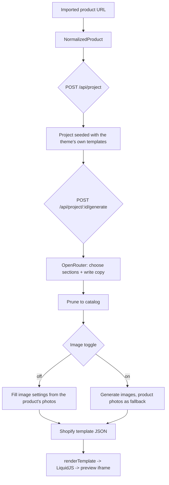

# Base Theme + AI Content Generation

How Shopforge renders the real Shopify theme and fills it with generated content. This
supersedes the six hand-written prototype sections and the narrow `StoreConfiguration`
described in `docs/product-spec/03-store-configuration.md`.

## What changed

| Before | Now |
|---|---|
| 6 hand-written `.liquid` sections | The real theme, vendored at `public/base-theme/` (86 sections, 130 snippets, 80 blocks) |
| `StoreConfiguration` (Shopforge-specific section list) | Shopify-native template JSON — the same shape Shopify's Admin API accepts |
| `generateInitialConfiguration()` — deterministic, no AI | Theme's own `templates/*.json` as the seed; OpenRouter generation as an explicit step |
| Section catalog hardcoded in `lib/sections/registry.ts` | Each section's own `` block, read straight from the `.liquid` file |

The store configuration **is** the template JSON now, so what the preview renders and what
gets published to Shopify are one artifact rather than two representations to keep in sync.

## Pipeline



Project creation does **not** block on generation — a full two-template run takes over a
minute, so a new project starts previewable on the theme's defaults and generation is a
separate call.

## The compatibility layer

`lib/shopify-compat/` closes the gap between LiquidJS and Shopify Liquid. It was scoped by
measurement, not guesswork: across the theme's sections, snippets and blocks there are 71
distinct filters and 21 distinct tags in use.

**Tags** (`tags.ts`) — four tags accounted for every parse failure:

| Tag | Uses | Behaviour in the preview |
|---|---|---|
| `` | 158 | Body rendered inside `<style>` |
| `` | 74 | `<form>` wrapper with no action — the iframe has no `allow-scripts`, so it can never submit |
| `` | 29 | Renders theme blocks from `blocks/<type>.liquid` |
| `` | 16 | Body renders once with a single-page `paginate` drop |

``, `` and `` parse and emit nothing.
`` and `` resolve section files and section groups.

**Filters** (`filters.ts`) — LiquidJS natively covers the string/array/math set; the ~25
Shopify-only ones are implemented at the smallest compatible behaviour. There is no image
resizing service, no font service and no address database behind the preview, so
`image_url` width/height args are accepted and ignored, and `font_face`/`font_url` return
empty.

**Drops** (`drops.ts`) — the theme is written against Shopify's storefront objects, so the
conversion happens here rather than by editing 86 sections. The important one: **Shopify
stores money as integer cents**, while the Normalized Product Contract carries decimal
currency units. `buildProductDrop` converts on the way in; the `money` filters convert back
on the way out.

**Filesystem** (`theme-fs.ts`) — `` (639 call sites) resolves against
`snippets/` only, exactly as Shopify does. Widening the root to `sections/` as well caused
infinite self-recursion where a section and a snippet share a name.

## The image toggle

`SHOPFORGE_GENERATE_IMAGES` in `.env`, overridable per request with
`POST /api/project/:id/generate {"generateImages": true}`, and exposed as a checkbox in the
editor header.

- **Off (default)** — every image setting is filled directly from the imported product's own
  photos, round-robin. No image model is called, nothing is billed.
- **On** — image settings are generated. Product photos are applied *first* as a fallback, so
  a partial or failed image run still yields a complete page rather than blank sections.

Off is the default because the scraped photos are the actual product; a generated stand-in is
usually worse for a store built around that product.

The model is told to leave image settings empty precisely so this step owns them.

## Guardrails on generated content

The model chooses sections from a curated catalog (`lib/ai/catalog/`, 27 sections and 59
blocks) rather than from all 86 — only sections whose schema has been reviewed and described.
After generation, `pruneToCatalog()` drops any section or block type that is not in the
catalog, so an invented section can never reach the preview. Per the product spec, the model
writes copy and picks layout; **it never writes Liquid, HTML, CSS or JavaScript**.

At render time, a section that throws degrades to an HTML comment rather than blanking the
page, so one bad section still leaves every other section visible.

## Typed settings must be resolved before Liquid sees them

Template JSON stores raw values — a hex string, a `shopify://` URL, a menu handle. Shopify
resolves each one into an object according to the `type` its `` declares, and
the theme reads properties off that object. Passing the raw value through means the theme
reads a property off a string and silently renders nothing.

Measured across this theme: 603 `color` settings, 183 `image_picker`, 164
`color_background`, 2 `link_list`, and 91 direct `.red`/`.green`/`.blue` reads.

| Type | Resolved to | Symptom when it isn't |
|---|---|---|
| `color` | `ColorDrop` with `.red`/`.green`/`.blue`/`.hue`… | `--color-background: , , ;` — the page loses all colour |
| `image_picker` | `ImageDrop` with `.src`/`.aspect_ratio` | logo height divides by `undefined` → 0, so the logo is invisible |
| `link_list` | `LinkListDrop` with `.links` | header claims `header--has-menu` and renders no nav |
| `font_picker` | `FontDrop` with `.family`/`.weight` | falls back to a serif stack |
| `product`/`collection`/`page`/`blog` | `null` | theme reads properties off a handle string |

Lives in `lib/shopify-compat/resolve-settings.ts` and `setting-drops.ts`, driven by each
section's own schema — so it covers all 86 sections rather than being patched per section.
Unset settings stay falsy so the theme's `!= blank` guards take the empty branch.

Because the preview has no store behind it, `linklists` is served from
`defaultLinkLists()` — a stand-in Home/Catalog/Contact menu — so the header and footer render
the structure a merchant would actually see instead of collapsing.

## `` needs globals, not scope

LiquidJS hides the caller's scope from `` but propagates `renderOptions.globals`
into it. Shopify behaves the same way: outer *variables* are hidden from a snippet, global
objects are not. Passing the Shopify context as the render scope left all **639** ``
sites without `shop`, `section`, `settings` or `product` — `snippets/header-logo.liquid`
renders `{{ shop.name }}` and produced an empty `<span>`.

## Rendering a theme without its JavaScript

The preview iframe is `sandbox="allow-same-origin"` and never `allow-scripts`
(`docs/product-spec/08-preview-iframe.md`). A production theme assumes its own JS runs, so
three things have to be compensated for. All three presented identically — a fully correct
DOM that painted nothing.

**Theme settings must fall back to schema defaults.** `config/settings_data.json` stores only
what a merchant changed — 13 of the 230 settings this theme declares. Everything else comes
from `default` in `config/settings_schema.json`. Missing that fallback is not a graceful
degradation: the layout computes
`--font-body-scale: {{ settings.body_scale | divided_by: 100.0 }}`, Liquid evaluates
`nil | divided_by: 100.0` as `0`, and `font-size: calc(var(--font-body-scale) * 62.5%)`
resolves to **0px** — so every `rem` in the theme measures zero and the whole page collapses
to 0×0 with its text still in the DOM. Handled by `lib/preview/theme-settings.ts`.

**`no-js` must become `js`.** The theme boots as `<html class="no-js">` and its first inline
script swaps the class. `base.css` hides every `.no-js-hidden` element until it does, and 22
of the theme's files use that class.

**`<noscript>` fallbacks must be hidden.** The browser treats a sandboxed iframe as
scripting-disabled, so it renders every `<noscript>` block — including the theme's no-JS
slider nav, which appeared as stray "1 2" links beside the real controls.

**The product media gallery must be pinned open.** `base.css` hides every
`.product__media-item` that lacks `.is-active`, a class the theme's `<media-gallery>`
element assigns on load. Without it the product page shows slider arrows around an empty box
while the product photos sit in the DOM, fully downloaded, at 0x0.

**Load animations must be pinned open.** Sections render as
`.animate-section.animate--hidden` with `.animate-item` children at `opacity: 0`; an
IntersectionObserver adds `animate--shown` on scroll. With no JS nothing is ever revealed.

The last two live in `lib/preview/preview-shims.ts`, applied to the finished HTML — never to
the theme's source files.

**`shopify://` images.** Merchant uploads are referenced as `shopify://shop_images/<file>`,
which only resolves against a real store's CDN. The theme's 73 demo uploads are vendored at
`public/base-theme/images/` (22MB) and the `image_url` filter rewrites the reference. Other
`shopify://` URLs resolve to `""` so the theme's own `` guards fall back to a
placeholder instead of emitting a broken ``.

## Known gaps

- **Theme demo templates have empty image settings.** The seeded homepage renders its hero
  and several media slots as placeholders because the theme's own `index.json` ships
  `"image": ""`. Generated templates fill those from the product.
- **Field-level selection.** The theme's sections do not emit Shopforge's `data-sf-setting`
  attributes, so the renderer wraps each section in a `data-sf-section-id` marker. Click-to-
  select and the Inspector work at section level; in-preview inline text editing needs a
  section to opt in with `data-sf-setting`.
- **One upstream theme bug fixed locally.** `snippets/card-product.liquid:75` had
  `assign = custom_name_identifier = ...` (stray `=`). Shopify tolerates it; LiquidJS does
  not. Fix it in `F:\theme-builder\AI_Schema` too, or the next copy re-introduces it.
- **Image generation is unverified end to end.** The off path is tested; the on path is
  implemented against OpenRouter's image modality but has not been run against a live image
  model.
- `templates/index.json` and `product.json` are the only generated pages. The theme ships 25
  templates.

## Running it

```bash
npx prisma generate && npx prisma migrate deploy
npm run dev
```

Environment (`.env`):

```
OPENROUTER_API_KEY=...
OPENROUTER_MODEL=google/gemini-3.7-flash
SHOPFORGE_GENERATE_IMAGES=false
```

Tests: `npm test` runs everything except the live-API test. That one costs money and takes
about two minutes:

```bash
RUN_AI_TESTS=1 npx vitest run lib/ai/generate.integration.test.ts
```
