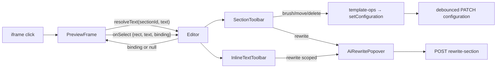

# Editor toolbars: magic brush, section toolbar, inline text editing

Second iteration of the reference-editor UX (first: [SECTION-AI-EDITING.md](SECTION-AI-EDITING.md)).
The four tools from the reference screenshots and where each lives here:

| Reference | What it does | Where |
| --- | --- | --- |
| Magic brush | Random (curated) color scheme applied to the selected section | Section toolbar → [lib/editor/magic-brush.ts](../lib/editor/magic-brush.ts) |
| Re-write | The AI prompt popover (built in iteration 1) | Section toolbar toggles [components/AiRewritePopover.tsx](../components/AiRewritePopover.tsx) |
| Edit Section | Opens the right-hand Inspector | Section toolbar → opens the (collapsible) SettingsPanel |
| Inline text editing | Click text → edit in place, with a floating Rewrite / size / color / delete toolbar | [components/InlineTextToolbar.tsx](../components/InlineTextToolbar.tsx) |

## Section toolbar

A floating vertical pill ([components/SectionToolbar.tsx](../components/SectionToolbar.tsx))
appears at the right edge of the preview, aligned with the selected section's top. Buttons,
top to bottom (hover tooltips, like the reference):

1. **Magic brush** (paintbrush icon) — applies the next curated palette to the section (see below).
2. **Re-write** (wand icon) — toggles the AI prompt popover, scoped to the whole section.
3. **Edit section** (sliders icon) — opens the Inspector panel (which now starts collapsed; the toolbar
   is the primary entry point, the panel is the precise fallback).
4. **Move up / down** (arrow icons) — reorders the section within the template's `order`.
5. **Delete** (trash icon) — removes the section from the template (with a confirm).

All editor toolbar icons are `lucide-react` stroke icons — never emoji, which render as
inconsistent colored glyphs across platforms.

Move/delete/brush are pure template-JSON operations
([lib/store-config/template-ops.ts](../lib/store-config/template-ops.ts)) — no AI call, no
server round-trip beyond the normal debounced save, instantly re-rendered.

## Magic brush

"Random colors" is random *among curated palettes*, never random RGB — a random hex triple
is almost always ugly and often unreadable. [lib/editor/magic-brush.ts](../lib/editor/magic-brush.ts)
ships ~12 hand-picked palettes (`background / text / accent / accentText`), picks one at
random that differs from the last one used, and maps it onto the theme's own custom-color
system:

- The Base Theme applies per-section custom colors only when `color_scheme == "custom"`
  (snippets/custome-colorscheme.liquid renders `--color-background` etc. for `.color-custom`).
  So the brush sets `color_scheme: "custom"` plus the five well-known settings —
  `custom_colors_background`, `custom_colors_text`, `custom_colors_solid_button_background`,
  `custom_colors_solid_button_text`, `custom_colors_outline_button` — whichever of them the
  section's schema declares.
- Sections that keep their colors on **blocks** (slideshow's slides) are handled by walking
  the section schema's block definitions and brushing every block instance whose schema
  declares the same settings.
- A section with **no custom color settings** (about half the theme — `main-product`,
  `image-banner`, most `main-*` templates) falls back to `cycleColorScheme`: the brush steps
  the section's `color_scheme` select to its next option (skipping `custom`, which would
  render as unset), wrapping around. So every section with a scheme select still recolors on
  click; only a section with no color settings at all is a no-op (the notice says so — no
  error).

Clicking again cycles to another palette, which doubles as "undo by re-roll".

## Inline text editing

The Base Theme's sections never emit `data-sf-setting` (they're authored for Shopify, not
this editor), so the DOM alone can't say which setting a clicked heading belongs to. Instead
the editor resolves it by **text matching**: on click, PreviewFrame finds the deepest
element with its own text, and asks the editor to locate that exact string inside the
selected section's JSON ([lib/editor/setting-locator.ts](../lib/editor/setting-locator.ts))
— section settings first, then blocks, recursively, comparing tag-stripped values. A unique
match returns a binding `{ blockPath, settingId }`.

- **Unique match** → the element becomes `contenteditable` (existing inline-edit mechanics)
  and the floating toolbar appears above it. Blur commits the new text into that exact
  setting via `setSettingAtPath`.
- **No match / ambiguous** (two blocks with identical text, or a click on a non-text area
  like an image or icon) → PreviewFrame instead walks up from the click to the nearest
  `data-shopify-editor-block` marker (the Shopify theme editor's own block attribute, emitted
  inertly by most theme blocks via `block.shopify_attributes`) and collects every such id up
  to the section root as `blockScope`. A "Re-write" from here scopes to that one block —
  `rewrite-section`'s `blockPath` with no `settingId` — instead of the whole section; see
  `RewriteScope` in [lib/ai/section-rewriter.ts](../lib/ai/section-rewriter.ts). Only a click
  that resolves to neither a text setting nor any block marker falls back to plain section
  selection.

### Editing the product name

Text equal to `product.title` (the product page's `<h1>`, sticky ATC, …) is product **data**
rendered by `{{ product.title }}` — no template setting holds it. The resolver checks this
case first and returns the pseudo-binding `PRODUCT_TITLE_SETTING`; committing it updates the
Product record via `PATCH /api/project/:id/product` (and local product state, which
re-renders the title everywhere it appears) instead of `configurationJson`. When the section
holds exactly one `product_title` block, the binding anchors to it so the toolbar offers that
block's own schema controls (size, alignment) — those writes go to the template as normal;
only the text itself goes to the Product record. AI rewrite works on it too, via its own
`rewrite-product-title` endpoint ([lib/ai/title-rewriter.ts](../lib/ai/title-rewriter.ts))
instead of `rewrite-section`'s catalog-scoped machinery — the result is written back to the
Product record the same way a manual edit is.

### Editing the product description

Same story as the product name: text equal to `product.description` (the description block)
is product data, not a template setting, so the resolver checks it right after the title and
returns the pseudo-binding `PRODUCT_DESCRIPTION_SETTING`. This one matters beyond consistency
— before it existed, clicking the description text resolved to nothing narrower than the whole
section, so "Rewrite" ran `rewrite-section`'s catalog-scoped machinery against JSON that never
contained the description in the first place. That request couldn't have changed it no matter
how it was scoped or how long it ran; at best the instruction went unfulfilled, at worst the
model spent the request "fulfilling" it by editing unrelated copy elsewhere in the section
instead. AI rewrite for it goes through its own `rewrite-product-description` endpoint
([lib/ai/description-rewriter.ts](../lib/ai/description-rewriter.ts)), and both it and manual
edits persist via the same `PATCH /api/project/:id/product` route the title uses (now extended
to accept `description` alongside `title`).

### The floating toolbar

Positioned above the clicked element (same-origin iframe → `getBoundingClientRect` maps 1:1
onto the overlay; recomputed on iframe scroll). Controls appear only when the bound block's
schema actually has them ([lib/editor/text-controls.ts](../lib/editor/text-controls.ts)):

| Control | Schema heuristic | Example |
| --- | --- | --- |
| Rewrite (wand icon) | always | opens the AI popover **scoped to this one setting** |
| − size + | select/range whose id matches `size`; the block's matching mobile size, when it has one, is paired with it and used while the mobile preview is on (see [Size follows the previewed viewport](#size-follows-the-previewed-viewport)) | heading's `heading_size` (h3→h0), text's `text_size` range, product_title's `desktop_size` + `mobile_size` |
| Align | select whose id matches `align` (excluding mobile) | heading/text/product_title's `alignment` (left/center/right); the matching `mobile_alignment` follows by option index — alignment is directional intent, so unlike size it moves mobile too |
| Weight | select whose id matches `weight` | hidden for this theme's heading/text (no weight setting) |
| Color swatch | `custom_color`/`custom_text_color`/`text_color`/`color` exactly, or any `*_text_color` (+ its `enable_custom_color` checkbox) | heading, text, `product_tabs`' `content_text_color` |
| Delete (trash icon) | binding is inside a block | deletes that block from the section |
| Close (X icon) | always | close |

Block schemas come from the section's own `` when declared there, else from the
theme-block file `blocks/<type>.liquid` (same `extractSectionSchema` parser, new
`loadBlockSchema` cache).

A control is only ever as good as the *theme*: where a block declares no setting at all, the
control cannot appear. `blocks/product_title.liquid` is the one merchants notice — it has
`desktop_size`, `alignment` and margins but **no color setting**, the `<h1>` taking its color
from the global heading scheme, so a product title offers no swatch. That is a theme gap, not
an editor one; closing it means adding `enable_custom_color`/`custom_text_color` plus the
matching CSS to that block.

### Which setting a control writes to

Matching by shape (`/size/`, `/align/`, a color id) routinely turns up several candidates in
one schema, because a section holds several independently-bound text fields. `pick()` chooses
between them on two signals, in this order:

1. **Position.** A candidate declared inside `[owner, next content field)` is vouched for
   outright — whatever it is called. This is what keeps parallax-hero's `heading_prefix_size`
   bound to `heading_suffix`, which it genuinely styles despite the "prefix" in its name.
2. **Naming.** Outside that zone, ids are compared word-by-word (digits dropped, plurals and
   `heading`/`title` folded together). A candidate is kept only if every *element* word in it
   is one the owner's id also uses; among survivors, the one dragging in no foreign word wins,
   then the one echoing the owner's own words most strongly.

Position alone is not enough, because a theme may declare a field's companions *above* it:
`product_tabs` styles `tab_N_content` with `content_size` and `content_text_color`, both
declared before the field. Naming alone is not enough either, hence the ordering above.

The naming rule is deliberately weaker for **alignment**. Size and color are per-field by
convention, but alignment in this theme is overwhelmingly a *container* property —
`vertical_items_align`, `icon_text_alignment`, `content_text_alignment` are all named after a
wrapper yet genuinely align the text inside it. Rejecting every unshared qualifier there
stripped ~147 working alignment controls across the base theme, so alignment only refuses
settings qualified by a control-row word (`button`, `btn`, `cta`) the owner does not share.
That is what stops `product_tabs`' lone `button_alignment` — which positions the tab BUTTON
row — from being offered as the alignment of a tab's body copy; it stays reachable in the
block's own settings panel, where it belongs.

When nothing survives, no control is shown. A missing control is recoverable; one that
quietly edits a different field's setting is not.

### Size follows the previewed viewport

Alignment is one intent mirrored onto a second setting, but a size *pair* is two independent
values the theme reads in different media queries. `blocks/product_title.liquid` sizes its
`<h1>` from `desktop_size`, then overrides that from `mobile_size` under `max-width: 749px`:

```liquid
.product__title-{{ block.id }} h1 { font-size: … block.settings.desktop_size … }
@media screen and (max-width: 749px) {
  .product__title-{{ block.id }} h1 { font-size: … block.settings.mobile_size … }
}
```

So with the mobile preview on, a step written to `desktop_size` changes a declaration the media
query is overriding and nothing moves on screen — the bug this pairing fixes. `findTextControls`
hangs the mobile half off the desktop control as `size.mobile`, and `sizeSettingFor(size,
viewport)` hands the toolbar whichever half is actually rendering; each keeps its own min/max/step,
so the −/+ stops at the mobile slider's own bounds. Blocks that declare a single size setting are
unchanged — that one setting governs both viewports.

A mobile-named candidate is only adopted when it is genuinely this control's other half
(`pairsWith`): the two ids must name the same element once control words are stripped — so
`product_tabs`' `tab_text_size_mobile` (its BUTTON labels) is refused for a tab's `content_size`
body copy — and the theme must read them the same way, same kind and same `visible_if`. That
last test is what keeps `blocks/heading.liquid`'s `custom_mobile_size` out: it is a number that
applies only while `heading_size == 'custom'`, and in every other mode the h0→h3 select governs
mobile too, its classes being responsive in the theme's own CSS.

### Picked colors move the strong/em highlight colors too

The theme treats `<strong>`/`<em>` inside a heading or text block as "highlighted text" with
its own color settings, applied by direct CSS rules on the `strong`/`em` element — which
beat the element's inherited custom color. In **gradient** mode it goes further: the text is
painted by `background: var(--hightlight-1--color)` + `background-clip: text` with a
*transparent* text fill, so the element's own `color` is completely invisible. The theme's
own templates ship titles wrapped *entirely* in `<strong>` with a gradient highlight, so a
picked text color used to change nothing visible. `applyColor` therefore writes every
highlight companion alongside the custom color — the solid ones (`title_highlight_N_color`,
`bold/italic_solid_color`) and the gradient ones (`title_highlight_N_gradient`,
`bold/italic_gradient_color`; a flat hex is a valid CSS background) — covered by an
end-to-end render regression test
([lib/editor/color-pick-render.test.ts](../lib/editor/color-pick-render.test.ts)) and
verified live in a real browser against the running editor.

### Rewrites cannot touch non-catalog settings

The model is shown the section's current JSON, which for theme-seeded sections carries
dozens of presentation settings the catalog never exposes (animation, highlight, custom
color toggles…). Echoing those back with drift once flipped a heading's
`enable_custom_color` during a copy rewrite — the stored color changed while the flag that
activates it stayed off, so "color is not getting applied". `sanitizeRewrittenSection` now
clamps every settings object to the catalog vocabulary: settings the catalog describes take
the model's values; every other setting keeps its original value verbatim. The inline
toolbar's color swatch also shows a hatched "no color" state while the enable flag is off,
so the swatch never claims a color the text doesn't have.

### Setting-scoped AI rewrite

The inline Rewrite button opens the same popover, but the request carries
`{ blockPath, settingId }`. The server appends "change ONLY this setting" to the
instruction **and enforces it structurally**: after the model responds, the stored section
is the original with just that one path's value replaced (`applyScopedRewrite` in
[lib/ai/section-rewriter.ts](../lib/ai/section-rewriter.ts)). A scoped rewrite therefore
cannot touch anything else, no matter what the model returns.

## Smooth updates (no blink, no scroll jump)

Re-rendering used to replace the iframe's `srcDoc`, reloading the whole document — every
inline edit blinked and threw the viewport back to the top. Now PreviewFrame applies a fresh
render **surgically**: it parses the new HTML, verifies the section list / head / layout are
unchanged, and **morphs** the sections whose markup differs
([lib/editor/dom-morph.ts](../lib/editor/dom-morph.ts)): only the nodes that actually differ
are patched, so unchanged elements stay alive. That last part is what stops sections from
blinking — rewriting a section's `innerHTML` recreates every `` in it, which re-decodes
and repaints even for a one-class change. Scroll position, selection outline and toolbar
anchors all survive; the toolbar re-finds the edited text by content match. Structural changes (move/delete section, full generation, page switch) still
do a real reload — with the scroll position captured and restored.

The "always a fresh render, never a DOM patch" rule still holds where it matters: the DOM is
always derived from a complete `renderTemplate()` output; only its application is diffed.

Editable-text affordance: hovering any text the editor can bind shows a dashed green
outline (and a subtle outline on hoverable sections), injected as `sf-editor-styles` into
the preview document — so "this is editable" is visible before the first click. Pressing a
toolbar control deliberately blurs an in-progress inline edit first, committing the typed
text before the size/color/rewrite action applies — nothing typed is ever lost.

## Data flow



## Undo / redo and the mobile preview toggle

The header carries two more control groups now, both in
[app/editor/[projectId]/page.tsx](../app/editor/[projectId]/page.tsx):

- **Undo/redo** — `Ctrl`/`Cmd`+`Z` to undo, `Ctrl`/`Cmd`+`Shift`+`Z` or `Ctrl`+`Y` to redo (also
  as toolbar buttons). Every commit to `configuration` or the product title snapshots the
  prior state onto an in-memory history stack (`historyRef`, capped at 50 entries) before
  applying the change; undo/redo pop that stack and go through the same `setConfiguration`/
  `setProduct` path as everything else, so the existing debounced-save effects persist the
  result normally — undoing and reloading the page doesn't come back. Edits within 700ms of
  each other (dragging a slider, typing a sentence) coalesce onto the same history entry so
  one undo reverts the whole gesture, not one keystroke. The shortcut is ignored while focus
  is in an input, textarea, or contenteditable — the browser's native undo handles typing
  there. Not implemented: undo history doesn't survive a page reload (it's in-memory only).
- **Mobile preview toggle** (desktop/phone icons) — shrinks the preview `<iframe>` to a fixed
  390px column instead of resizing the whole app; the theme's own responsive CSS reacts to
  that narrower layout viewport the same way it would on a phone. Because the iframe no
  longer necessarily fills its container, `PreviewFrame`'s `toRect()` folds the iframe's own
  `getBoundingClientRect()` back into every selection rect — without that offset, the section/
  text toolbars would still be positioned as if the iframe were full width. The toggle also
  feeds the inline toolbar: with it on, the −/+ edits the block's mobile size setting rather
  than its desktop one (see [Size follows the previewed viewport](#size-follows-the-previewed-viewport)).

## Deliberately not built yet

- **Add a block** (the green "+ Add a block" in the reference) — needs a block palette UI
  and per-section default settings; next iteration.
- **Font weight** — the toolbar supports it, but this theme's heading/text blocks expose no
  weight setting, so it never shows today.
- **Live device preview via QR code** — some competitors offer a "scan to preview on your
  phone" panel backed by a public tunnel URL; out of scope here (no tunneling infrastructure).
