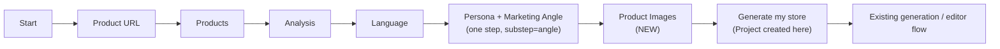
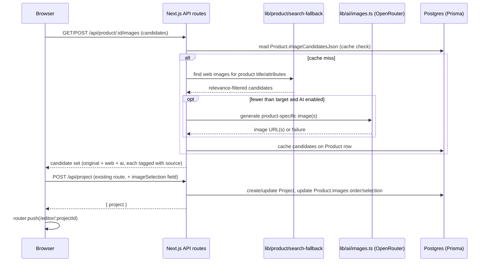

# Product Images Wizard Step — Investigation & Implementation Plan

Status: **planning only, not implemented**. This is the investigation report requested for the new "Product Images" wizard step (inserted after Persona + Marketing Angle, before store generation). No code was written as part of this document.

## 1. Current architecture findings

### Wizard shell
- The entire import wizard is **one client component**, [app/import/page.tsx](../app/import/page.tsx) (~1450 lines), driven entirely by `?step=` and related query params on `/import`. There is no per-step route folder and no React context/Zustand/Redux — state is 100% URL-encoded and re-derived on every render (`useSearchParams()`).
- [components/ProgressSteps.tsx](../components/ProgressSteps.tsx) hardcodes the visible steps:
  ```ts
  const STEPS = ["Start", "Product URL", "Products", "Analysis", "Language", "Persona"] as const;
  ```
  and takes `step: 1 | 2 | 3 | 4 | 5 | 6`. There is **no "Generate my store" wizard step today** — the wizard's last action creates a `Project` row and immediately `router.push`es into `/editor/[projectId]`, a separate screen with its own "Generate content" button.
- Screen components, in wizard order: `ImportForm` (Product URL) → `ProductResults` (Products) → `ProductAnalysisScreen` (Analysis) → `LanguageScreen` (Language) → `PersonaScreen` (Persona, with an internal `substep=angle` state for Marketing Angle — never a 7th progress-bar entry, per an explicit code comment referencing a prior planning doc).
- Transitions are plain `router.push()` calls that manually re-serialize **every** prior query param plus new ones, e.g. (persona → angle substep):
  ```ts
  router.push(`/import?source=${source}&${backParam}&selected=${selectedProductId}&step=persona&language=${selectedCode}${personaQuery}`);
  ```
  Back buttons do the same in reverse (not `router.back()`), which is why back/forward "just works" — the whole page tree is a pure function of the URL.

### The Persona + Marketing Angle precedent (most relevant prior art)
Implemented in one screen, [PersonaScreen](../app/import/page.tsx) (lines ~809–1389), with two internal states switched by a `substep` query param:
- `substep` absent → persona sub-state; `substep=angle` → marketing-angle sub-state. `ProgressSteps` is called with `step={6}` in **both** — the progress bar never moves for the substep.
- Options for both persona and marketing angle are AI-generated via OpenRouter and **cached on the `Product` row** (`personaOptionsJson`, `marketingAnglesJson`), keyed by language (+ persona, for angles), so revisiting/back-navigating never re-bills the AI call.
- Only the **angle** sub-state's Continue button is a real wizard-ending action: it POSTs `/api/project` (creating/updating the `Project` row) and navigates to `/editor/[projectId]`.

This tells us two things that matter directly for the new step:
1. **The pattern for "new wizard concept, cached before Project exists" is: cache generated candidates on `Product`, thread the selection through the URL.** This is the correct precedent for image *candidates* (search/AI results), since a step inserted before "Generate my store" has no `Project` row to write to yet.
2. **The pattern for "nested sub-state that shouldn't bump the progress bar" is a `substep` param** — but the user's ask is for a genuinely new, distinct step ("insert after Persona + Marketing Angle"), so the more relevant precedent is actually how Language/Persona themselves were added as new top-level steps: extend `ImportPageInner`'s step branching, extend `ProgressSteps.STEPS`/its type, add a new screen component.

### Project creation is late, not early
- `Project` is created **only** at the wizard's final action ([app/api/project/route.ts](../app/api/project/route.ts), `POST /api/project`), called from `PersonaScreen.handleAngleContinue()`. `productId` is `@unique` on `Project` — one Project per Product, update-in-place on re-run.
- Nothing is persisted to a `Project` row for Product URL / Products / Analysis / Language / Persona — those all live in the URL, with AI-generated option sets cached on `Product`.
- **Implication:** a Product Images step placed before the current final step has nowhere to persist selections against `Project` yet. It must follow the `Product`-side caching pattern (like personas/angles) and pass the final selection through to the (now later) `POST /api/project` call, OR become the new final step itself and write directly to `Project` at creation time. See §4/§12 for the recommendation.

### Product model & images today
- Prisma is the only ORM ([prisma/schema.prisma](../prisma/schema.prisma)); only two models exist: `Product` and `Project`. No `Asset`/`Media`/`GeneratedAsset` table exists anywhere, despite one being **designed on paper** in [docs/product-spec/13-assets.md](product-spec/13-assets.md) (an `Asset`/`GeneratedAsset` pair with checksum-based dedup, `AssetRef { url, alt, source }`) — that design was never implemented.
- `Product.images` is `Json @default("[]")`, validated client/server-side by `ProductImageSchema` in [lib/product/types.ts](../lib/product/types.ts):
  ```ts
  ProductImageSchema = z.object({ url: z.string(), altText: z.string().nullable().default(null) });
  ```
  No `position`, no `source`/provenance field. Images are **bare remote URLs**, rendered directly (``) — nothing downloads, re-encodes, proxies, or re-hosts them. `next.config.ts` has no `images.remotePatterns` config either.
- There is currently **no endpoint to edit `Product.images`** — `PATCH /api/project/[id]/product/route.ts` only accepts `{ title }`. A mutation path for image selection is new work.
- No duplicate-image detection, no server-side broken-URL/liveness check (only a client `` → "No image" placeholder fallback, and a per-platform CDN hostname allowlist used only inside the search-fallback path, not for Shopify/generic-HTML imports).

### Existing web-search fallback (real prior art for "web-discovered images")
[lib/product/search-fallback/](../lib/product/search-fallback/) is a working, tested system used today when direct product scraping is incomplete (mainly Amazon/Etsy bot-wall cases):
- Uses OpenRouter chat completions with either a native-search model (e.g. `perplexity/sonar`) or `openrouter:web_search`/`web_fetch` tools — **same `OPENROUTER_API_KEY`**, no separate search API.
- Search-tool text results carry no images by themselves; images come from a secondary enrichment pass, [page-enrich.ts](../lib/product/search-fallback/page-enrich.ts), which fetches each candidate's own page and mines JSON-LD `image` → `og:image` → platform-specific HTML fallback.
- [relevance.ts](../lib/product/search-fallback/relevance.ts) scores **candidate titles** (not images) via identity-token vs. modifier-token matching (e.g. "bucket bag" is an identity match; "beige"/"leather" are modifiers) — this is exactly the mechanism needed to reject "random handbag because same broad category" and keep "bucket bag" results.
- [platforms.ts](../lib/product/search-fallback/platforms.ts) `isTrustedImageUrl()` is a per-platform CDN hostname allowlist (Etsy: `*.etsystatic.com`; Amazon: `*.media-amazon.com` etc.) — a display-trust gate, not a fetch-validator.
- Well covered by tests (`index.test.ts`, `page-enrich.test.ts`, `relevance.test.ts`, supplier-specific tests).

**This is the strongest, most reusable candidate for "web-discovered supplementary images."** It already does title-based relevance filtering and platform-trust gating; it would need to be pointed at "find more images of this exact product" rather than "find this listing on another marketplace," and its trust allowlist would need broadening beyond Etsy/Amazon CDNs for a general web-image search.

### AI image generation — exists, but explicitly unverified
[lib/ai/images.ts](../lib/ai/images.ts) already implements an OpenRouter-based image-generation path:
- `resolveImages()` is the toggle: **off (default)** → `applyProductImages()` round-robins the product's own scraped photos into every image-valued theme setting; **on** (`SHOPFORGE_GENERATE_IMAGES=true` or a per-request flag) → `generateImages()`, which calls `requestImage()` per target.
- `requestImage()` calls OpenRouter chat completions with `model: config.imageModel` (env `OPENROUTER_IMAGE_MODEL`, default `openai/gpt-image-1`) and `modalities: ["image", "text"]`, reading the result out of `message.images[0].image_url.url`. **Same `OPENROUTER_API_KEY`** — no second provider key.
- [docs/BASE-THEME-AND-AI-CONTENT.md](BASE-THEME-AND-AI-CONTENT.md) states explicitly: *"Image generation is unverified end to end. The off path is tested; the on path is implemented against OpenRouter's image modality but has not been run against a live image model."* This is implemented-but-unproven code, not production-ready capability.
- Today this code generates **decorative/section images** (hero banners, etc.), not "more photos of this specific product" — repurposing it for product photography would need a product-specific prompt (title/attributes/existing photo as reference) rather than the current generic "ecommerce lifestyle photograph" prompt.
- No other image-generation provider (DALL-E direct, Stability, Replicate, fal.ai, Ideogram, Recraft) exists anywhere in the codebase or `package.json`.

### Theme rendering — no real Shopify integration yet, but the gallery is already fully dynamic
This is a critical, previously-unstated fact: **Shopforge has no Shopify OAuth, Admin API/GraphQL client, or theme-publish code at all.** "Generate my store" (the editor's "Generate content" button) only regenerates two JSON *templates* (`index`, `product`) via an LLM and writes them into `Project.configurationJson`; nothing is pushed to a real Shopify store. Real Shopify publishing is fully speced ([docs/product-spec/14-shopify-publishing.md](product-spec/14-shopify-publishing.md)) but not built.

The **preview** is a client-side render of a vendored Dawn-style theme (`public/base-theme/**`) through a custom LiquidJS-compatible engine ([lib/shopify-compat/engine.ts](../lib/shopify-compat/engine.ts)), fed a synthesized Shopify-shaped "drop" built from DB data:

- [lib/shopify-compat/drops.ts](../lib/shopify-compat/drops.ts) `buildProductDrop()` maps `Product.images` → a Shopify `media`-shaped array:
  ```ts
  const images = product.images.map((img, i) => imageDrop(img.url, img.altText, i + 1));
  const featured = images[0] ?? null;
  return { ..., images, media: images, featured_image: featured, featured_media: featured, ... };
  ```
  (`width`/`height`/`aspect_ratio` are hardcoded placeholders — 1200×1200/1 — regardless of the real image, a latent inaccuracy for gallery aspect-ratio CSS.)
- The theme's own Liquid (`main-product.liquid` → `product-media-gallery.liquid` → `product-thumbnail.liquid`/`product-media-modal.liquid`) consumes `product.media`/`product.featured_image` completely generically — **no hardcoded product-image URLs in Liquid**.

**Consequence: if the new step writes its final selection into `Product.images` (ordered, first = featured), the product-page gallery updates automatically with zero theme changes.** `Product.images` is the correct, singular integration point.

**However, there is a real competing-source-of-truth risk to design around:** at "Generate content" time, `lib/ai/images.ts` copies `Product.images` URLs **by value** into `Project.configurationJson` for unrelated sections (hero/banner image pickers). Those copies do not stay in sync if `Product.images` changes afterward. This is pre-existing behavior, not something the new step introduces, but the new step must not assume "editing `Product.images` retroactively fixes everything downstream" — only the gallery (which reads live) benefits; already-baked hero/banner settings do not.

## 2. Proposed wizard flow



`ProgressSteps.STEPS` becomes `["Start", "Product URL", "Products", "Analysis", "Language", "Persona", "Images"]` (7 entries; type widens to `1..7`). Persona + Marketing Angle remains exactly one progress-bar entry, unchanged, per the hard constraint.

**Recommended change to where the wizard "ends":** move `Project` creation from the angle step's Continue to the new Images step's "Generate my store" button. The angle step's Continue instead navigates to `step=images` (carrying all existing query params forward, same convention as every other transition). This makes "Generate my store" a real, honestly-named wizard step for the first time, and gives image selection a natural place to be included in the single `POST /api/project` payload — avoiding a second half-created `Project` state.

## 3. Image sourcing strategy

| Source | Role | Why |
|---|---|---|
| Existing product images (`Product.images`) | **Primary** | Already scraped, already trusted, zero extra cost/latency, guaranteed relevant (it's literally the product). Always shown first/prominently. |
| Web search fallback (extended) | **Secondary/fallback** | Reuses tested infra ([search-fallback/](../lib/product/search-fallback/)) with existing title-relevance scoring to reject category-level false matches. Only invoked when the product has fewer than the desired candidate count. Populates "Other images we found for your product." |
| AI-generated images | **Optional, off by default** | Capability exists (`lib/ai/images.ts`) but is explicitly documented as unverified against a live model, and generates generic "lifestyle" imagery today, not targeted product photography. Treat as an experimental top-up only if the first two sources leave fewer than ~3 candidates, gated by an explicit flag, and only after a manual live-model verification pass (see §11/§12). Do not make it a default path. |

Rejected as unnecessary: a brand-new paid image-generation or image-search provider. Nothing in the investigation shows the existing two real sources (scraped + web-search) are insufficient for the common case (a product page with at least 2–3 of its own photos).

## 4. Data model and persistence

### Minimal viable change (recommended)
Extend `ProductImageSchema` (and the `Product.images` JSON shape) with two optional fields, kept backward compatible:
```ts
ProductImageSchema = z.object({
  url: z.string(),
  altText: z.string().nullable().default(null),
  source: z.enum(["original", "web", "ai-generated"]).default("original"),
  selected: z.boolean().default(true), // whether it's part of the wizard's final 5
});
```
- `source` distinguishes original/imported vs. web-discovered vs. AI-generated, satisfying the "distinguish image roles" requirement, without introducing a new table.
- Order in the array = gallery order (`imageDrop()` already uses array index as `position`); first item = featured image. No extra `position` field needed if we keep array order authoritative — matches how `buildProductDrop()` already works today.
- Original imported images are never mutated in place — new candidates (web/AI) are **appended**, never overwrite existing entries, and the "final 5" selection is expressed via `selected`/reordering, not deletion of the original scrape record. (If stricter non-destruction is wanted, keep a separate `Product.discoveredImages: Json` array for web/AI candidates and only copy the user's final selection into `Product.images` at "Generate my store" time — see decision list in §12.)

### Candidate caching (before Project exists)
Follow the persona/marketing-angle precedent exactly: web-search and AI-generation candidate results are **generated once and cached on the `Product` row** (new nullable JSON column, e.g. `Product.imageCandidatesJson`), keyed by product (+ maybe a content hash of title/attributes, mirroring `personaOptionsJson`'s language-keying) so:
- Revisiting the step or navigating back/forward never re-triggers search/generation calls.
- New Prisma migration follows the exact established shape: `npx prisma migrate dev --name add_image_candidates` adding one nullable `Json` column, same as `add_customer_persona`/`add_marketing_angle`.

### Selection state through the wizard
- The **candidate set** lives server-side (cached on `Product`).
- The **user's selection** (which candidate IDs, in what order, up to 5) rides the wizard URL like every other choice (`&images=id1,id2,id3`), consistent with how `persona`/`angle` are threaded today, so back/forward restores it.
- On product change (new `productId` in the URL), the existing staleness-guard pattern used by `PersonaScreen` (discard a selection that doesn't match the freshly-loaded candidate set for the current product) applies directly — reuse, don't reinvent.
- At "Generate my store," the final ordered selection is submitted in the existing `POST /api/project` body (new field, e.g. `imageSelection: string[]`) and written into `Product.images` (reordered/filtered) and/or a `Project`-level snapshot at creation time — see open decision in §12 about whether `Product.images` itself gets reordered or a separate `Project.selectedImagesJson` is kept.

No new database engine, ORM, or table is required for the recommended minimal approach. The heavier `Asset`/`GeneratedAsset` design in `docs/product-spec/13-assets.md` remains a valid future direction (checksums, dedup, upload provenance) but is not required to ship this step and is out of scope here.

## 5. API/server flow



- **API keys** (`OPENROUTER_API_KEY`) never leave the server: all calls happen inside `app/api/**/route.ts` handlers or the `lib/ai`/`lib/product/search-fallback` modules they import, exactly like the existing persona/marketing-angle/search-fallback code. No `NEXT_PUBLIC_*` variables are introduced.
- New route: `POST /api/product/:id/images` (mirrors `.../personas` and `.../marketing-angles`) — accepts product context (already available server-side from the `Product` row; no need for the client to resend title/description), returns a candidate list, caches on `Product`.
- Existing route `POST /api/project` gains one optional field (`imageSelection`) and, at creation/update time, applies it to `Product.images`.

## 6. UI behavior

- **Initial loading**: skeleton/placeholder cards while `POST /api/product/:id/images` resolves (cache hit returns near-instantly, same as personas/angles today).
- **Generated/found state**: a prominent primary row (product's own images + any strong web/AI matches) and a smaller "Other images we found for your product" row for lower-confidence web candidates — matching the reference layout, without hardcoding the reference's example product.
- **Selected state**: visually obvious (border/checkmark overlay), consistent with existing selection patterns in `ProductCard`/`PersonaScreen` option cards.
- **Unselected state**: default/neutral card styling.
- **Max 5 selection**: clicking a 6th candidate is a no-op (or prompts to deselect one first) — enforced client-side for UX and re-validated server-side on submit (never trust client-only enforcement for the final write).
- **Fewer than 5 valid images**: do not pad with unrelated images. Show only the valid candidates found; the "Generate my store" CTA remains enabled with fewer than 5 selected (per the requirement: "define a sensible fallback," not force incorrect fills). If zero images exist at all, show an honest empty state (no product photo, no fabricated one) rather than blocking the wizard.
- **Generate my store button**: enabled once at least the product's own images (if any) are available/selected; disabled only while candidates are still loading for the very first time.

## 7. Theme-generation integration

1. User's final selection (ordered, ≤5) is submitted with the existing `POST /api/project` call.
2. Server writes the ordered, filtered list back into `Product.images` (source-tagged per §4).
3. No changes needed to `lib/shopify-compat/drops.ts` or any Liquid template: `buildProductDrop()` already maps `Product.images[0]` → `featured_image`/`featured_media` and the full array → `media`/`images`, and the theme's `product-media-gallery.liquid`/`product-thumbnail.liquid` already render generically from those.
4. The pre-existing hero/banner "copy at generate-content time" behavior in `lib/ai/images.ts` is unaffected and remains a known, separate, non-live-synced representation — flagged, not fixed, by this step (fixing it is a larger change to `lib/ai/images.ts`/`content-generator.ts`, out of scope here unless the user wants it folded in).
5. `imageDrop()`'s hardcoded 1200×1200/aspect-ratio-1 placeholder is worth revisiting only if the gallery's CSS aspect ratio becomes visibly wrong for non-square selected images — flagged as a minor follow-up, not a blocker.

## 8. Failure and edge cases

| Case | Behavior |
|---|---|
| No images found (no scrape, no web match) | Honest empty state; wizard proceeds with zero selected images; gallery renders whatever the theme's own empty-state Liquid does today. |
| Only 1–2 valid images | Show what exists; no padding; "Generate my store" stays enabled. |
| Broken/expired remote image | Client `onError` (existing `ProductCard` pattern) hides the broken card or shows a "unavailable" placeholder; never silently swapped for an unrelated image. |
| Unrelated search results | Rejected before display via `relevance.ts` identity-token scoring (reused, tuned for "is this the same product," not "same category"). |
| Duplicate images | Simple URL-equality dedup at candidate-assembly time (no perceptual hashing needed for v1 — no duplicate-detection infra exists today and isn't required for correctness here). |
| AI generation failure/timeout | Falls back silently to fewer candidates (never a broken/placeholder image); matches existing `generateImages()` fallback-to-product-photo behavior in `lib/ai/images.ts`, adapted to fallback-to-nothing for this step since there's no "must fill this slot" requirement. |
| Search timeout | Same — return whatever completed within budget, cache what succeeded, don't block the step indefinitely (reuse `search-fallback`'s existing timeout handling). |
| Provider unavailable (`OPENROUTER_API_KEY` missing) | Web-search/AI candidates simply don't populate; original product images still show; matches existing `AiConfigError` → graceful-degrade pattern used elsewhere. |
| User reaches 5 selected | Further clicks no-op/prompt to deselect first. |
| User deselects | Card returns to unselected state; no data loss (candidate stays in the set). |
| User goes backward | Selection persists via URL param, same guarantee as persona/angle today. |
| User changes product | Old candidates/selection are discarded — apply the same staleness-guard pattern `PersonaScreen` already uses (selection compared against the freshly-loaded candidate set's product id). |
| Page refresh | Candidate set re-fetches from the `Product`-cached results (near-instant, no re-billing); selection re-derives from URL. |
| Generation request retried | `POST /api/project` is already idempotent per `productId` (`@unique`, update-not-duplicate) — image selection updates follow the same idempotent write. |

## 9. Testing plan

- **Unit**: new `lib/product/images/*` (candidate assembly, relevance reuse, source-tagging, 5-cap enforcement) — mirror the style of `lib/product/search-fallback/relevance.test.ts`.
- **API/integration**: `POST /api/product/:id/images` (cache hit/miss, empty-result, AI-disabled path) and the extended `POST /api/project` (image selection persisted, idempotent update) — mirror `app/api/product/[id]/personas` / `marketing-angles` route tests if present, or add equivalent coverage following their pattern.
- **Persistence tests**: candidate caching on `Product.imageCandidatesJson` survives repeated calls without re-invoking search/AI (assert mock call counts, same technique as persona/angle caching tests).
- **Wizard navigation tests**: back/forward through the new step preserves selection; changing product upstream clears stale selection (manual or component test depending on existing test tooling for `app/import/page.tsx`, if any exists — investigation did not find dedicated component tests for this file, so this may be the first).
- **Image relevance/filter tests**: extend `relevance.test.ts`-style cases with the bucket-bag example from the brief — assert a beige leather bucket bag does not surface generic handbag results.
- **Theme-generation tests**: extend `lib/shopify-compat/drops.test.ts` (currently does not exist — should be added) asserting `buildProductDrop()` correctly reflects `Product.images` order/featured selection; extend `lib/preview/template-renderer.test.ts` to assert actual gallery ``/media output, which it currently does not check.
- **Browser/manual smoke tests**: run the wizard end-to-end for a real scraped product, confirm selection reaches the editor preview gallery, confirm featured image matches first selection.

## 10. Files likely to change

Existing files:
- [components/ProgressSteps.tsx](../components/ProgressSteps.tsx) — add "Images" step, widen type to 7.
- [app/import/page.tsx](../app/import/page.tsx) — add `step=images` branch, new screen component, move Project-creation call from angle Continue to the new step's Continue.
- [prisma/schema.prisma](../prisma/schema.prisma) — extend `Product.images` shape (schema-level, JSON so no column change) and add `Product.imageCandidatesJson Json?`; new migration.
- [lib/product/types.ts](../lib/product/types.ts) — extend `ProductImageSchema` with `source`/`selected`.
- [app/api/project/route.ts](../app/api/project/route.ts) — accept/apply `imageSelection`.
- [app/api/project/[id]/product/route.ts](../app/api/project/[id]/product/route.ts) — possibly extend `PATCH` if images need editing after Project creation too.
- [lib/product/search-fallback/index.ts](../lib/product/search-fallback/index.ts) / [platforms.ts](../lib/product/search-fallback/platforms.ts) — extend/generalize for "more images of this product" queries and broaden the trust allowlist beyond Etsy/Amazon if general web images are sourced.
- [lib/ai/images.ts](../lib/ai/images.ts) — reuse `requestImage()`, add a product-photo-specific prompt builder if AI top-up is enabled.

New files (indicative, exact names TBD at implementation time):
- `app/api/product/[id]/images/route.ts` — candidate-generation endpoint.
- `lib/product/images/candidates.ts` (or similar) — orchestrates original + web + AI sourcing, relevance filtering, 5-cap logic.
- A new wizard screen component (e.g. `ProductImagesScreen`, likely inline in `app/import/page.tsx` following the existing single-file convention, or extracted if the team prefers — matches how `LanguageScreen`/`PersonaScreen` are currently structured inline).
- `lib/shopify-compat/drops.test.ts` — currently missing, should exist regardless of this feature.

## 11. Dependencies / API keys

- **Can existing infrastructure be reused?** Yes, for both candidate sources: `lib/product/search-fallback/*` for web images, `lib/ai/images.ts` for optional AI generation. Both already authenticate via the existing server-side `OPENROUTER_API_KEY`.
- **Can `OPENROUTER_API_KEY` be reused?** Yes — no new key required for either web search or the (optional, off-by-default) AI image path.
- **Does the current OpenRouter model support image generation?** The default text model (`google/gemini-3.7-flash`) does not. A separate, already-configured model string (`OPENROUTER_IMAGE_MODEL`, default `openai/gpt-image-1`) is called specifically for image generation via OpenRouter's multimodal chat-completions convention — this exists in code today but is **explicitly documented as unverified against a live model**.
- **Is a separate image-generation API/key required?** No, not to ship the primary (existing images) + secondary (web search) sourcing. AI generation, if enabled at all, reuses the existing OpenRouter path — no new provider.
- **Can web search provide suitable images without another API?** Yes, using the existing OpenRouter-backed `search-fallback` infrastructure and its page-enrichment (JSON-LD/og:image) logic — no new search API.
- **Cost implications**: Web-search candidate fetching = additional OpenRouter search-model calls, cached per-product (one-time cost, not repeated on revisit/back-forward). AI image generation, if enabled, is the most expensive path per-image and is recommended **off by default**, used only as a last-resort top-up, gated behind explicit opt-in until the "unverified" status in `docs/BASE-THEME-AND-AI-CONTENT.md` is resolved.

## 12. Implementation order

1. Verify the AI image-generation path live (a manual/small script test against `OPENROUTER_IMAGE_MODEL`) to resolve its "unverified" status before depending on it for anything user-facing — or explicitly decide to ship v1 without the AI path.
2. Extend `ProductImageSchema`/`Product.images` shape (`source`, `selected`) and add `Product.imageCandidatesJson`; write the Prisma migration.
3. Build the candidate-assembly module (original images pass-through + web-search reuse + relevance filtering); ship without AI generation first.
4. Build `POST /api/product/:id/images` route with `Product`-side caching, following the personas/marketing-angles route pattern exactly.
5. Add the new wizard step: `ProgressSteps` update, `app/import/page.tsx` branch, new screen component, URL-param selection state, staleness guard on product change.
6. Move `Project` creation from the angle step's Continue to the new Images step's Continue; extend `POST /api/project` to accept and apply the final selection.
7. Verify theme integration end-to-end manually: select images in the wizard, confirm the editor's product-page gallery reflects order/featured image with no theme code changes.
8. Add tests per §9 (start with candidate relevance and API route tests, then persistence/navigation, then theme/drop tests).
9. Only after the above is stable, evaluate turning on the AI-generation top-up behind an explicit flag, with its own dedicated test coverage and a live-model smoke test.

## Recommendation and decisions needing approval

**Recommendation:** ship a v1 that sources images from (a) the product's own scraped photos and (b) an extension of the existing web-search fallback, with AI generation left off by default until verified live. This requires no new provider, no new paid API key, and reuses every piece of infrastructure the investigation found — search relevance filtering, OpenRouter server-side calling pattern, `Product`-side caching for pre-Project state, and the already-dynamic theme gallery binding via `Product.images`.

Decisions needed before implementation starts:

1. **Does "Generate my store" become a real new final wizard step**, with `Project` creation moved there (recommended), or should Project continue to be created at the angle step and the Images step become a *post-creation* screen that patches the `Project`/`Product`? (Affects §2 and §12 step 6.)
2. **Should original scraped images ever be reordered/filtered in `Product.images` itself**, or should the wizard's final selection be stored separately (e.g. `Project.selectedImagesJson`) so `Product.images` remains an untouched historical record of the raw scrape? (Affects §4, §7.)
3. **Should AI-generated product images be in scope for v1 at all**, given the documented "unverified end to end" status, or should v1 ship with only original + web-search sourcing and AI treated as a fast-follow? (Affects §3, §11, §12.)
4. **How far should the web-search trust allowlist be broadened** beyond the current Etsy/Amazon CDN allowlist for general product-image search, and is there an acceptable additional cost/latency budget for this per-product? (Affects §3, §5, §11.)
5. **Is fixing the known hero/banner "stale copy" issue in `lib/ai/images.ts`** (image selection changes not propagating to already-generated template sections) in scope for this feature, or explicitly deferred? (Affects §1, §7.)
