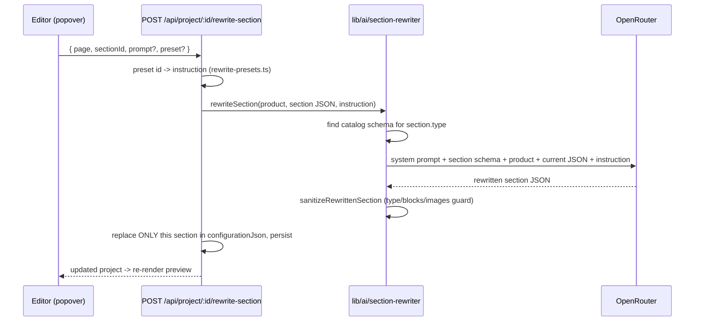

# Section-wise AI editing

Click a section in the preview → a floating AI prompt appears over it (like the reference
editor): type an instruction, or hit a one-click chip, and **only that section** is rewritten
and saved. The right-hand Inspector is now collapsible, so the AI popover is the primary way
to edit and the settings panel is the precise fallback.

## UX

```
┌────────────────────────────────────────────────┬──────────────┐
│ Preview (iframe)                               │ Inspector    │
│                                                │ (collapsible │
│   [selected section]  ┌─────────────────────┐  │  to a slim   │
│                       │ Enter a prompt…  ✕ ↑│  │  ⚙ rail)     │
│                       ├─────────────────────┤  │              │
│                       │ QUICK SUGGESTIONS   │  │              │
│                       │  − Shorter  + Longer│  │              │
│                       │  ✦ Simplify ↻ Fix sp│  │              │
│                       │ CHANGE ANGLE        │  │              │
│                       │  ❤ Emotional ◆ Logic│  │              │
│                       │  ☺ Social  ⏰ Urgency│  │              │
│                       │  ✧ Aspir.  🔥 FOMO  │  │              │
│                       └─────────────────────┘  │              │
└────────────────────────────────────────────────┴──────────────┘
```

- **Popover** ([components/AiRewritePopover.tsx](../components/AiRewritePopover.tsx)) renders
  whenever a section is selected. A chip never submits — it fills the input with the preset's
  short editable prompt; only Enter / ↑ sends. Submitted unedited, the preset id is sent (the
  API expands it to the richer instruction); edited, the user's text is sent as typed.
  Esc or ✕ deselects.
- **Inspector collapse** — the panel header gained a `⟩⟩` button; collapsed, it becomes a
  slim vertical "⚙ Settings" rail that reopens it. Collapse is independent of selection:
  `Close` clears the selection, `⟩⟩` only hides the panel.

## Architecture



One request rewrites one section; the rest of the page is byte-for-byte untouched. That is
what makes it fast (~seconds, vs >1 min for full generation) and safe to iterate on.

## Prompt design

Per-section prompts are **assembled, not hand-written 27 times**. Every rewrite prompt is
composed of four parts, three of which come from data that already exists:

| Part | Source |
| --- | --- |
| Base system prompt (hard rules, output shape) | `SYSTEM_PROMPT` in [lib/ai/section-rewriter.ts](../lib/ai/section-rewriter.ts) |
| Section-specific context: purpose, settings + allowed values, allowed blocks, `_notes` | that section's catalog JSON, via `describeCatalog([schema], blocks)` |
| Product context (title, brand, price, description, options) | `describeProduct()` — the same brief full generation uses |
| The instruction | the user's typed prompt and/or a preset from [lib/ai/rewrite-presets.ts](../lib/ai/rewrite-presets.ts) |

So adding a new section to the catalog automatically makes it AI-editable with a correct,
schema-constrained prompt — there is no second per-section prompt list to maintain.
Temperature is 0.4 (vs 0.7 for generation): a rewrite should stay close to the original.

### Hard rules (system prompt)

- Keep `type` — this is editing, not replacing.
- Only setting keys in the schema; enum settings use one of the allowed values.
- Image/video settings returned unchanged (and enforced after the fact anyway).
- Existing blocks and ids kept unless the instruction requires otherwise; new blocks only
  from `allowed_blocks`, `max_blocks` respected.
- No Liquid/HTML/CSS/JS; richtext limited to `<p>/<strong>/<em>`.
- Change only what the instruction asks; everything else returned untouched.

### Guardrails after the model responds (`sanitizeRewrittenSection`)

1. `type` is forced back to the original.
2. Blocks not in the section's `allowed_blocks` are dropped; `block_order` is truncated to
   `max_blocks`.
3. Every image setting is restored to its original value; image slots on newly added blocks
   are filled from the product's own photos (round-robin), never from model output.
4. The result must parse as `ShopifySectionSchema` or the rewrite errors — a malformed
   response can never reach the stored configuration.

Sections whose type is **not** in the catalog (header, footer-group internals, and the other
~59 base-theme sections) return `422 SectionNotRewritableError` — those are edited via the
Inspector.

## Every section and its AI-editing context

The "Purpose" column below IS the per-section prompt context — it is read from
`lib/ai/catalog/sections/*.json` at request time, together with each section's settings,
allowed values, and `_notes`. "Copy settings" is what a text rewrite will touch directly;
"(via blocks)" means the copy lives in the section's blocks, whose own schemas are included.

| Section | Purpose (fed to the model) | Pages | Copy settings | Blocks |
| --- | --- | --- | --- | --- |
| `collage` | Display a collage of images and products in various layouts | index, page, product | title, heading | image, product |
| `collapsible-content` | Heading/image plus a stack of collapsible (accordion) content rows — commonly used for FAQ pages | index, product, page | caption, title | collapsible-row-content |
| `colors-changer` | Site-wide color scheme override section (accent, text, background, product card colors) | index, product, page | (via blocks) | — |
| `comparison-table` | Product comparison table with features | index, product, page | title, text, us_label, others_label | row |
| `contact-form` | Contact form with customizable fields | page | title | field_row, textarea, tnc_checkbox |
| `content-tabs` | Tabbed content with each tab containing rich content including images, text, videos | index, page, product | title | tab |
| `custom-columns-new` | Flexible multi-column layout section for arbitrary content blocks | index, product, page | (via blocks) | column |
| `custom-columns` | Legacy multi-column layout with various content blocks distributed across columns | index, page, product | title | heading, text, image, video, buttons, icon-with-text, rating-stars, countdown-timer, email-signup, custom-liquid, collapsible-row, media-slider, payment-badges, atc-button, text-with-icon, trustpilot-stars |
| `email-signup-banner` | Full-width banner with a background image and an email capture form | index, password | (via blocks) | heading, paragraph, email_form |
| `facebook-testimonials` | Display a slider of Facebook-style customer testimonial posts | index, product, page | title, text | column |
| `featured-collection` | Display a collection of products | index, product, page | title | — |
| `footer` | Site-wide footer with navigation links and a newsletter signup | footer-group | (via blocks) | link_list, email_signup |
| `horizontal-ticker` | Scrolling content ticker that moves horizontally with text, images, or videos | index, page, product | (via blocks) | text, image, video |
| `icon-bar` | Display icons with text in a horizontal row for features or benefits | index, page, product | title, text | column |
| `image-slider` | Slider gallery of images and/or videos | index, product, page | title | image_slide, video_slide |
| `image-with-text` | Image with accompanying text content | index, product, page | (via blocks) | heading, text, button, caption, image |
| `main-product` | Main product information section with all product blocks | product | (via blocks) | product_title, product_price, product_description, product_buy-buttons, product_product-variant-picker-block, rating-stars, product-rating, product_quantity-selector, product_inventory, product_urgency, product_tabs, product_sticky-atc, … (all product blocks) |
| `newsletter` | Newsletter subscription form | index, product, page | button_label | heading, paragraph, email_form |
| `related-products` | Show a grid of products related to the current product, on product pages | product | title, button_label | — |
| `results` | Display statistics and results with percentages | index, product, page | title, text | row |
| `rich-text` | General-purpose text content section built from stackable content blocks | index, product, page | (via blocks) | heading, caption, rating-stars, trustpilot-stars, text, button, atc-button, container |
| `section-divider` | Visual divider between sections with customizable style | index, page, product | (via blocks) | — |
| `shoppable-image` | A large lifestyle image with clickable product hotspots | product | title, text | hotspot |
| `slideshow` | Image slideshow with text overlay and buttons | index, product, page | (via blocks) | slide |
| `testimonials` | Customer reviews and testimonials slider | index, product, page | title | column |
| `track-order` | Order-tracking form where a customer enters a tracking number | page | title, text, input_label, button_label | — |
| `vertical-ticker` | Scrolling text ticker that moves vertically | index, page, product | (via blocks) | text |

Sections with `_notes` in their catalog file (e.g. collage's "MAXIMUM 3 blocks", layout
rules) get those notes verbatim inside the schema description the model sees.

## Preset chips

Defined once in [lib/ai/rewrite-presets.ts](../lib/ai/rewrite-presets.ts) and imported by both
the popover (labels/grouping) and the API route (the instruction) — a chip can never drift
from what it does.

| Chip | Group | Instruction summary |
| --- | --- | --- |
| Shorter | quick | Cut filler, keep the strongest claim |
| Longer | quick | Add concrete product detail, not filler |
| Simplify | quick | Plain language, short sentences |
| Fix spelling | quick | Spelling/grammar only — nothing else changes |
| More emotional | angle | Lead with how owning/using it feels |
| Logical benefits | angle | Specs, durability, savings; minimal adjectives |
| Social proof | angle | Customer trust, phrased credibly; no invented statistics |
| Urgency/Scarcity | angle | Act-now framing; no fabricated stock counts or deadlines |
| Aspirational | angle | Sell the outcome and identity, not the object |
| FOMO | angle | What the shopper misses by waiting; truthful in specifics |

## API

`POST /api/project/:id/rewrite-section`

```json
{ "page": "index", "sectionId": "hero-banner", "prompt": "mention free shipping", "preset": "shorter" }
```

- `prompt` and `preset` compose ("Additionally: …") when both are sent; at least one is required.
- `model` optionally overrides `OPENROUTER_MODEL` for the run.
- Errors: 400 bad input · 404 missing project/section · 409 stale configuration ·
  422 section not in catalog · 501 no API key · 502 OpenRouter error.
- On success the whole updated project row is returned; the editor re-parses
  `configurationJson` and re-renders — the same contract as `/generate`.

## Future work (not built yet)

- **Block-level rewrite** — selection already carries `settingId`; scope the instruction to
  one block/setting for even tighter edits.
- **Undo / history** — keep the pre-rewrite section JSON client-side for a one-click revert.
- **Streaming / optimistic UI** — shimmer the section while the rewrite runs.
- **Positioned popover** — anchor to the selected section's bounding rect (needs the iframe
  to report `getBoundingClientRect` on select) instead of the preview's top-right corner.
