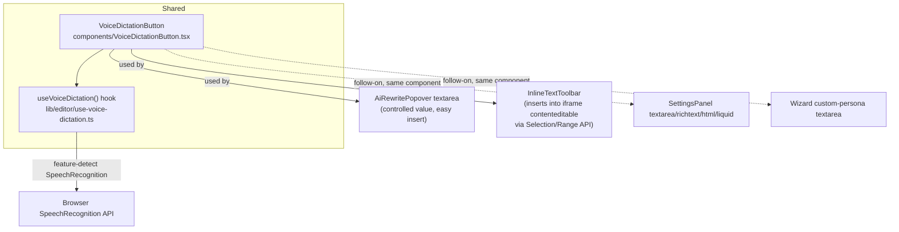

# Voice Dictation — Investigation & Implementation Plan

Status: **implemented for both named V1 targets** (AI prompt textarea + inline edit-bar
contenteditable text), per §11's implementation order steps 1–4. Manual cross-browser/device
verification (step 5) is outstanding — see the note at the end of this file. Roadmap ask:

> Say it instead of typing it. Hold the microphone in the edit bar or in the AI prompt, speak,
> and the words land in the field — a whole store's worth of copy written as readily on a
> phone as at a desk.
>
> - Dictate into any field or AI prompt
> - Follows the language the store was set to
> - Transcript editable before it is kept
> - Works on desktop and on mobile

## 1. Current architecture findings

### The two named targets already exist as two different input mechanisms
- **"AI prompt"** = [components/AiRewritePopover.tsx](../components/AiRewritePopover.tsx)'s `<textarea>`
  ([AiRewritePopover.tsx:136](../components/AiRewritePopover.tsx#L136)) — a normal React-controlled
  textarea (`value={prompt}` / `onChange`). Easy target: inserting text is just `setPrompt(...)`.
- **"Edit bar"** = [components/InlineTextToolbar.tsx](../components/InlineTextToolbar.tsx), the
  floating toolbar shown above a clicked heading/text element
  ([docs/EDITOR-TOOLBARS.md](EDITOR-TOOLBARS.md)). The toolbar itself holds no text input — the
  text being edited is the preview iframe's own `contenteditable` element (existing inline-edit
  mechanics). A mic button here must dictate **into that contenteditable node inside the iframe**,
  not into the toolbar, which is the harder of the two targets (no React-controlled `value`; text
  must be inserted at the caret via the DOM Selection/Range API, then the existing blur-commit
  path persists it — see `setting-locator.ts` / `PATCH configuration` flow already documented in
  EDITOR-TOOLBARS.md).
- Other free-text fields exist beyond the two named in the roadmap copy: the Inspector's
  `textarea`/`richtext`/`html`/`liquid` fields in [components/SettingsPanel.tsx:207](../components/SettingsPanel.tsx#L207)
  and the wizard's "Write your own persona" textarea in
  [app/import/page.tsx:1585](../app/import/page.tsx#L1585). Both are plain controlled textareas —
  once a reusable mic component exists, wiring these in is the same one-line pattern as the AI
  prompt, not new work. Recommend treating them as an easy follow-on, not part of the two named
  V1 targets.

### Store language is already modeled — but as ISO 639-1, not a speech locale
[lib/store-config/language.ts](../lib/store-config/language.ts) holds the store's target
customer-content language (`StoreLanguage.code`, e.g. `"en"`, `"fr"`, `"pt"`) — used today only to
steer AI generation copy (`languageInstruction()`). It is explicitly **not an app/UI locale**
(see the file's own header comment) and is not currently read anywhere on the client for anything
speech-related.

The browser speech API needs a **BCP-47 locale** (`en-US`, not `en`) to bias recognition
correctly — a bare ISO 639-1 code is accepted by some engines but degrades accuracy (e.g. `pt`
alone doesn't tell the recognizer Brazilian vs. European Portuguese). None of that mapping exists
yet; it needs a new small table (§4).

### No speech/transcription code, dependency, or provider exists anywhere today
`package.json` has no speech/audio package; `lib/ai/` has no transcription endpoint. The only AI
provider wired up is OpenRouter, used exclusively for **chat-completions** calls (generation,
rewrite, persona/angle, image generation) — see [lib/ai/config.ts](../lib/ai/config.ts) and
`AiConfig.model`/`imageModel`. There is no existing "send audio, get text back" code path to
extend; this is new capability end to end.

## 2. Transcription approach

Two ways to turn a spoken phrase into the text that lands in a field:

| Approach | How | Pros | Cons |
| --- | --- | --- | --- |
| **Browser Web Speech API** (`SpeechRecognition` / `webkitSpeechRecognition`) | Client calls the browser's own speech engine directly; no network call we control, no server code | Zero AI-credit cost, zero added latency, streams interim results live (matches "words land in the field" in real time), works fully offline-of-our-servers | Not a web standard yet — Firefox desktop has no implementation at all; Chrome/Edge (desktop + Android) and Safari (macOS 14.1+/iOS 14.5+) support it via the `webkit`-prefixed global. Audio is sent to the browser vendor's own cloud recognizer (Google for Chrome, Apple for Safari) — not to us, but still a third-party hop worth disclosing. |
| **Server-side transcription** (record audio via `MediaRecorder`, `POST` to a new route, transcribe with an audio-capable model) | New `/api/transcribe` route, e.g. via an OpenRouter audio-input-capable model or a dedicated Whisper-class API | Consistent behavior on every browser, including Firefox | New provider/cost/latency per utterance, needs an upload step before any words appear (kills the "live as you speak" feel), new API surface, new failure modes (upload failure, provider timeout) |

**Recommendation: ship V1 on the Web Speech API only**, feature-detected. This matches what the
roadmap copy actually describes — words appearing live in the field while speaking, no visible
"processing" step — which only the browser API delivers, and it requires no new backend, no new
API key, and no added AI-credit cost. Browsers without support (Firefox desktop; older Safari)
simply don't get a mic button — see §6 for the exact fallback behavior. A server-side fallback for
100% browser coverage is listed as explicit future work (§12), not blocking V1.

## 3. Interaction design — hold-to-talk

The roadmap copy says "**Hold** the microphone... speak, and the words land in the field," not
"click to toggle." This is a deliberate, specific interaction (like a walkie-talkie / voice-note
button), and it maps cleanly onto `SpeechRecognition`'s own `start()`/`stop()` calls:

- `onPointerDown` on the mic button → `recognition.start()`, mic button enters a visibly "live"
  state (pulsing ring, matches the app's existing busy/spinner visual language in
  `AiRewritePopover`).
- `onPointerUp` / `onPointerLeave` / `onPointerCancel` → `recognition.stop()`. Releasing outside
  the button (drag-off, common on mobile) must still stop listening — never leave the mic hot.
- **Interim results** (`interimResults: true`) are inserted into the field live as they arrive,
  so text visibly appears while still speaking, matching "the words land in the field."
- On `stop()`, the **final** result replaces the interim text for that utterance. Nothing is
  auto-submitted: dictation only ever populates the field's existing text state, identical to how
  a preset chip in `AiRewritePopover` fills-not-submits today. The user still presses Enter / the
  arrow button (AI prompt) or blurs/continues editing (edit bar) themselves — this is what "editable
  before it is kept" means in practice, and it falls out of reusing the exact commit path each
  field already has, not a new "confirm transcript" UI.
- Holding again appends a new utterance at the caret rather than overwriting the field, so a user
  can dictate in short bursts (natural for longer copy) instead of one unbroken take.

## 4. Language handling

Add a small BCP-47 mapping alongside the existing language table so speech recognition is biased
to the store's own target language, not the browser's UI language:

```ts
// lib/store-config/dictation-locale.ts
export const STORE_LANGUAGE_TO_SPEECH_LOCALE: Record<string, string> = {
  en: "en-US", fr: "fr-FR", de: "de-DE", es: "es-ES", it: "it-IT",
  pt: "pt-PT", nl: "nl-NL", pl: "pl-PL", /* ...remaining ALL_STORE_LANGUAGES codes */
};
export function speechLocaleFor(code: string): string {
  return STORE_LANGUAGE_TO_SPEECH_LOCALE[code] ?? "en-US";
}
```

- The **AI prompt** popover always has a project/product in scope, so it can read the project's
  stored `language` code directly and set `recognition.lang = speechLocaleFor(code)`.
- The **edit bar** (inline text editing) is editing store copy in that same project, so it uses
  the identical project language — no separate lookup needed.
- This only sets the recognizer's expected input language (what language the user is *speaking*);
  it does not translate. Speaking French into a store set to French is transcribed as French text
  — exactly "follows the language the store was set to." Speaking a different language than the
  store's setting is a user-error case (§7), not something to silently auto-translate.
- Non-speech-only pages (e.g. the wizard's free-text persona textarea, before a language is
  necessarily finalized) fall back to `speechLocaleFor(DEFAULT_STORE_LANGUAGE)` or, if available at
  that step, the in-progress wizard language selection.

## 5. Architecture



- **`useVoiceDictation(options)`** — one hook, feature-detects `window.SpeechRecognition ??
  window.webkitSpeechRecognition`; exposes `{ supported, listening, start(), stop() }` plus an
  `onInterim(text)` / `onFinal(text)` callback pair (not internal state) so each caller decides how
  to apply the transcript to *its own* text target — a `setState` call for the textarea case, a
  Range-insertion call for the contenteditable case. Keeping insertion logic outside the hook is
  what lets one hook serve both a controlled `<textarea>` and a raw `contenteditable` DOM node
  without the hook needing to know which kind of field it's talking to.
- **`VoiceDictationButton`** — the mic icon + hold gesture + pulsing "listening" visual state,
  wired to the hook. Renders `null` when `!supported` (§6) rather than a disabled/greyed icon —
  a control nobody on that browser can ever use is better omitted than shown broken.
- **AI prompt wiring**: `AiRewritePopover` passes `onInterim`/`onFinal` that call `setPrompt(prev
  => prev + text)`, appending at the end (the textarea has no meaningful "caret position" concept
  worth preserving across a hold-release-hold cycle for a single-purpose prompt box).
- **Edit bar wiring**: `InlineTextToolbar`'s `onInterim`/`onFinal` insert at the live browser
  `Selection`/`Range` inside the iframe's contenteditable element (`document.execCommand(
  "insertText", false, text)` on the iframe's own `document` is the pragmatic choice here — it is
  deprecated but still universally implemented, and is already the same class of DOM
  text-mutation the existing inline-edit code relies on; a manual Range-splice is the fallback if
  a target browser ever drops `execCommand` support). This is the one piece of real new
  complexity in the feature — everywhere else is "call a callback with a string."

## 6. Browser/feature-support behavior (no support ≠ broken UI)

| Condition | Behavior |
| --- | --- |
| `SpeechRecognition` unsupported (Firefox desktop, old Safari) | Mic button doesn't render at all — text input still works exactly as it does today, nothing looks broken or half-built. |
| Mic permission denied by the user | `onerror` (`"not-allowed"`) stops the listening state and shows a small inline notice ("Microphone access denied") near the button; never a silent no-op that looks like the app ignored the hold. |
| No speech detected during a hold (`"no-speech"`) | Listening state simply ends with nothing inserted — not an error banner, since "held it and let go without speaking" is a normal, harmless occurrence, not a fault. |
| Network error mid-recognition (`"network"`) — Chrome/Edge route recognition through a cloud endpoint | Stop listening, show the same lightweight inline notice; whatever was already transcribed as interim text stays in the field (never rolled back) so nothing spoken is lost. |
| Not on HTTPS (and not `localhost`) | `SpeechRecognition` is unavailable by spec — same as "unsupported": no mic button. Production is already HTTPS-only; only affects certain non-`localhost` dev/preview setups. |
| User navigates away / blurs the field mid-hold | `pointerleave`/`pointercancel`/component-unmount all call `stop()` — recognition never keeps running against a field that's no longer visible. |

## 7. Failure and edge cases

| Case | Behavior |
| --- | --- |
| Spoken language doesn't match the store's set language | Recognizer still transcribes in whatever language it hears reasonably well (browser engines are not strictly locked to `lang`), just with lower accuracy bias; no attempted auto-translation — matches "follows the language the store was set to" as an input hint, not a translation feature. |
| Very long continuous dictation | `continuous: true` with `interimResults: true`; browser engines already chunk long utterances into multiple `result` events internally, each appended — no special handling needed beyond the existing interim/final accumulation. |
| Multiple rapid hold-release cycles (short bursts) | Each hold is an independent `start()`/`stop()` pair; text appends at the end (AI prompt) or at the last caret position (edit bar) — no special "session" state to manage between holds. |
| Two mic buttons open at once (impossible today — only one popover/toolbar renders at a time) | Not reachable given current single-selection editor state; no dedicated guard needed. |
| Dictating profanity/PII spoken by accident | Same editable-before-kept guarantee as typing — nothing is sent to the AI or saved until the user submits/blurs, so a misheard or unwanted word is just edited or deleted like any typo. |
| Mobile Safari's mic permission prompt appearing mid-gesture | `start()` itself triggers the OS permission prompt on first use; the pointer-up that ends the accidental first "hold" is expected to produce no transcript that time — normal, first-use-only friction, not a bug to special-case. |

## 8. Testing plan

- **Unit**: `useVoiceDictation` against a mocked `SpeechRecognition` (jsdom has no real
  implementation) — assert `start`/`stop` wiring, interim/final callback sequencing, and the
  `"not-allowed"`/`"no-speech"`/`"network"` error branches without touching real audio.
- **Component**: `VoiceDictationButton` — asserts it renders `null` when the mocked global is
  absent, and that pointerdown/pointerup/pointerleave/pointercancel call the right hook methods.
- **Integration**: `AiRewritePopover` — mock the hook, assert an `onFinal` callback appends into
  the existing `prompt` state correctly (reuses the component's existing render/interaction tests
  if present, following the pattern other components in this repo use).
- **No automated test can verify real speech recognition** (it's a live browser/OS/network
  capability, not something jsdom or Playwright can simulate meaningfully) — final verification is
  a **manual smoke test** on: Chrome desktop, Chrome Android, Safari iOS, Safari macOS, and a
  confirmation that Firefox desktop shows no mic button and everything else still works.

## 9. Files changed (as built — see §13 for the final shape)

New files:
- `lib/editor/voice-dictation.ts` + `.test.ts` — framework-agnostic `SpeechRecognition`
  controller (§5).
- `lib/editor/use-voice-dictation.ts` — the React hook wrapping it.
- `lib/editor/dictation-insert.ts` — the contenteditable insert-in-place logic (§13).
- `components/VoiceDictationButton.tsx` — the shared mic button (§5).
- `lib/store-config/dictation-locale.ts` + `.test.ts` — ISO 639-1 → BCP-47 mapping (§4).

Existing files:
- [components/AiRewritePopover.tsx](../components/AiRewritePopover.tsx) — mic button next to the
  textarea, wired to append transcript into `prompt`.
- [components/InlineTextToolbar.tsx](../components/InlineTextToolbar.tsx) — mic button, wired to
  call a new `onDictate(text, isFinal)` prop.
- [components/PreviewFrame.tsx](../components/PreviewFrame.tsx) — converted to `forwardRef`,
  exposing `insertDictatedText(text, isFinal)` via `useImperativeHandle` (§13).
- [app/editor/[projectId]/page.tsx](../app/editor/[projectId]/page.tsx) — holds the
  `PreviewFrame` ref, reads `Project.language`, passes `dictationLang`/`onDictate` down.

Follow-on (not V1, same component, trivial once it exists):
- [components/SettingsPanel.tsx:207](../components/SettingsPanel.tsx#L207) — Inspector's
  `textarea`/`richtext`/`html`/`liquid` fields.
- [app/import/page.tsx:1585](../app/import/page.tsx#L1585) — wizard's custom-persona textarea.

## 10. Dependencies / API keys / cost

- **No new npm package required** — `SpeechRecognition`/`webkitSpeechRecognition` is a browser
  global, not a library.
- **No new API key required** — the browser vendor (Google for Chrome, Apple for Safari) handles
  the actual recognition off-device; Shopforge never sees or pays for that call.
- **No added AI-credit cost** — this doesn't touch `OPENROUTER_API_KEY` or `AIUsageEvent` at all
  in the V1 (browser-only) design. Worth stating plainly since every other AI-adjacent feature in
  this codebase is credit-metered; voice dictation deliberately isn't.
- **Privacy note worth surfacing to users/legal**, not a blocker: Chrome's implementation sends
  captured audio to Google's cloud speech service to produce a transcript; Safari's may run
  on-device depending on OS/settings. Nothing is stored by Shopforge itself.

## 11. Implementation order

1. Build `useVoiceDictation` + `VoiceDictationButton` against a mocked `SpeechRecognition`, unit
   tested, no editor wiring yet.
2. Add `dictation-locale.ts`; confirm `recognition.lang` is actually set from the project's stored
   language on a manual test (verify pronunciation-accuracy improvement isn't a silent no-op).
3. Wire into `AiRewritePopover` first — it's the controlled-textarea case, the simpler of the two
   named targets. Manual smoke test on Chrome desktop.
4. Wire into `InlineTextToolbar` / the iframe contenteditable — the harder Range-insertion case.
   Manual smoke test that dictated text still round-trips through the existing
   `setSettingAtPath`/blur-commit flow correctly (no regression to the mechanics documented in
   EDITOR-TOOLBARS.md).
5. Manual cross-browser/device pass: Chrome desktop, Chrome Android, Safari iOS, Safari macOS,
   Firefox desktop (confirm graceful absence).
6. Only after the above ships and is validated, consider the SettingsPanel/wizard follow-ons (§9)
   and/or a server-side transcription fallback for Firefox coverage (§12) as separate, later work.

## 12. Explicitly deferred (not V1)

- **Server-side transcription fallback** for browsers without `SpeechRecognition` (mainly Firefox
  desktop) — would need a new `/api/transcribe` route, an audio-capable model or dedicated
  provider, and a "record → upload → wait → transcript appears" interaction that no longer matches
  the roadmap's "live as you speak" description. Worth revisiting only if Firefox coverage becomes
  an actual reported gap.
- **Toggle-to-talk as an alternative to hold-to-talk** — the roadmap text specifically says "hold,"
  but a tap-to-start/tap-to-stop mode is a trivial variant of the same hook if user feedback wants
  hands-free longer dictation later.
- **Punctuation/formatting voice commands** ("new line", "comma") — the browser APIs don't offer
  this reliably across engines; out of scope.

## Recommendation and decisions needing approval

**Recommendation:** ship V1 as browser-only Web Speech API, hold-to-talk, scoped to exactly the
two targets named in the roadmap copy (AI prompt textarea + inline edit-bar contenteditable text),
using the store's already-modeled language code mapped to a BCP-47 locale. No new provider, no new
API key, no added AI-credit cost, no backend changes at all — everything ships client-side.

Decisions — resolved:

1. **Browser-only V1, no server fallback.** Firefox desktop gets no mic button until/unless a
   server-side fallback is built later (§12 stays deferred, not in scope now).
2. **Hold-to-talk**, as written in §3 — confirmed, not a toggle.
3. **V1 scope is the two named targets only** — AI prompt textarea + inline edit-bar
   contenteditable. Inspector/wizard textareas (§9) stay a follow-on, not part of this pass.

Plan is approved as written. Proceeding to implementation per §11's order.

## 13. Implementation notes (as built)

Steps 1–4 of §11 are done; step 5 (manual cross-browser/device pass) has not been run and is the
one thing standing between this and "verified working," not just "compiles and unit-tests green."

- **This repo has no jsdom / React Testing Library.** Every existing test is a pure-logic vitest
  test in the default `node` environment — no component or hook is rendered anywhere. Rather than
  adding new test infrastructure mid-feature (a bigger, separate decision), all the *testable*
  logic was written as framework-agnostic modules with no React/DOM dependency and unit tested
  against a mock `SpeechRecognition`:
  - `lib/editor/voice-dictation.ts` — the recognizer controller (18 tests: feature detection,
    hold lifecycle, interim/final routing, error-code mapping, re-listen-after-end).
  - `lib/store-config/dictation-locale.ts` — the locale map, plus a test that fails if a future
    store language is added without a matching BCP-47 entry.

  `lib/editor/use-voice-dictation.ts` (the React hook) and `components/VoiceDictationButton.tsx`
  are thin wrappers with no independent logic of their own — consistent with how the rest of this
  codebase only unit-tests `lib/` logic, never components.

- **The contenteditable insertion piece (§5's "one piece of real new complexity") turned out to
  need more than `execCommand`.** `execCommand("insertText", …)` alone has no way to distinguish
  "replace the previous still-refining interim guess" from "append a new chunk," so repeated
  interim events would otherwise duplicate text (recognizer revising "hello wor" → "hello world"
  would leave "hello worhello world" behind). `lib/editor/dictation-insert.ts` instead keeps a
  direct reference to the one text node holding the current utterance's not-yet-final guess,
  reassigning its `.data` on each interim revision and clearing the reference on a final result —
  so the next utterance (a second hold) starts a fresh node positioned after the committed one.
  This is real DOM Selection/Range manipulation with **no automated test** (same jsdom gap as
  above) — it is the one part of this feature that is unverified until a live browser check.

- **`PreviewFrame` now exposes an imperative handle.** It previously had no `ref` API at all —
  every DOM interaction (click-to-select, inline edit, blur-commit) lived entirely inside its own
  `useEffect`/closures, invisible to the parent page. Voice dictation is the first feature that
  needs the *parent* (where the mic button and its hook live) to reach back into the iframe's
  live selection, so `PreviewFrame` was converted to `forwardRef` and now exposes exactly one
  method, `insertDictatedText(text, isFinal)`, built on the same `trackedRef` it already
  maintained internally for toolbar repositioning — no new tracking state, just a new way to read
  the existing one.

- **Not yet done: the manual smoke test §8 calls for** — Chrome desktop, Chrome Android, Safari
  iOS, Safari macOS (confirm both mic placements actually insert text correctly, confirm
  hold/release feels right on a touchscreen, confirm the dictated text survives blur-commit into
  the stored section JSON) and Firefox desktop (confirm the mic simply doesn't appear and nothing
  else regresses). This cannot be done from here — it needs a person with real devices/browsers
  running `pnpm dev` against a real project.
