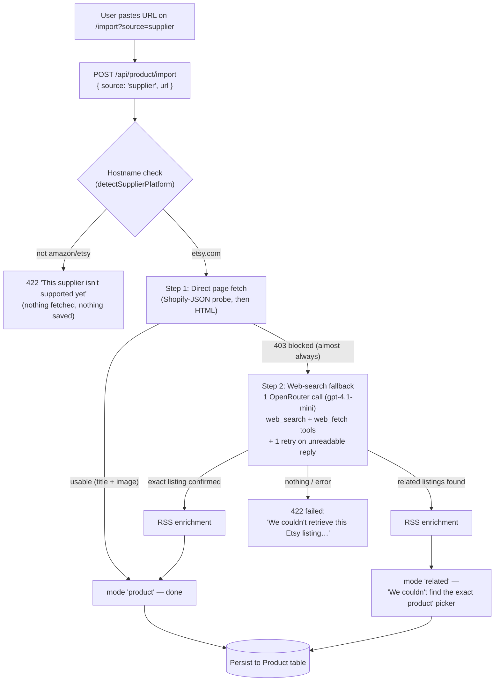

# Etsy Supplier Import — Current-State Audit Report

Date: 2026-08-21 · Branch: `feat/product-scraping-import` · Scope: how a pasted Etsy URL becomes a product (or fails), everything verified against the live code and live API calls made during this audit.

---

## 1. End-to-end flow (what happens when you paste an Etsy URL)

Every outcome (including failures) resolves to a status — the pipeline never throws. Related results are persisted as normal (partial) products and labeled "Related" in the UI picker.

## 2. Module inventory

| Module | Lines | Role |
| --- | --- | --- |
| [app/import/page.tsx](../app/import/page.tsx) | — | Import screen; renders `mode: "related"` as the "We couldn't find the exact product" picker |
| [app/api/product/import/route.ts](../app/api/product/import/route.ts) | 143 | API entry; dispatches shopify/supplier/competitor/sample; persists results via Prisma |
| [lib/product/import.ts](../lib/product/import.ts) | 401 | Orchestrator; `importSupplierProduct` holds the Etsy branch (lines ~211–250) |
| [lib/product/fetcher.ts](../lib/product/fetcher.ts) | 249 | Only network layer for merchant URLs; SSRF hardening, 10s timeout, size limits |
| [lib/product/suppliers/etsy.ts](../lib/product/suppliers/etsy.ts) | 198 | Etsy URL parsing (listing ID, slug title, canonical URL) + shop-RSS enrichment |
| [lib/product/search-fallback/index.ts](../lib/product/search-fallback/index.ts) | 187 | Generic web-search fallback: prompt building, verdict parsing, salvage + domain filter |
| [lib/product/search-fallback/openrouter-client.ts](../lib/product/search-fallback/openrouter-client.ts) | 106 | Bounded OpenRouter chat call; 45s timeout, 2MB response cap, never throws |
| [lib/product/suppliers/amazon.ts](../lib/product/suppliers/amazon.ts) | 33 | (Amazon only) static-HTML price/image fallback — separate path, not used for Etsy |

Config: `OPENROUTER_API_KEY` (required for the fallback), `OPENROUTER_MODEL` (optional; defaults to `openai/gpt-4.1-mini`). No other keys are used anywhere in the Etsy flow.

## 2b. Scope: which URLs use this workflow

The search-fallback + RSS workflow described in this report is **Etsy-only**. The restriction is hardcoded twice: `importSupplierProduct` only calls the fallback from its Etsy branch, and `PLATFORM_DOMAINS` in [search-fallback/index.ts](../lib/product/search-fallback/index.ts) maps only `etsy`.

| URL type | Path | Search fallback | RSS enrichment |
| --- | --- | --- | --- |
| Etsy | direct fetch → OpenRouter search → related picker | yes | yes |
| Amazon | direct fetch → JSON-LD/OG → static HTML fallback (`#landingImage`, price) | no | no |
| Other suppliers (AliExpress, …) | rejected up front ("isn't supported yet"), never fetched | no | no |
| Shopify source (default) | `products.json` / JSON-LD, or store-discovery crawl | no | no |
| Competitor source | discovery crawler (products.json → sitemap → homepage links) | no | no |

Live check (this audit): an Amazon product page fetched with the app's User-Agent returned **HTTP 200 containing a captcha/robot-check page** — no product data, no `#landingImage`. So Amazon imports currently dead-end with "no recognizable product data" and have no fallback layer at all. (Amazon's block is harder to detect than Etsy's: Etsy 403s, Amazon 200s a captcha, so `likelyBotBlocked` — which keys off status codes — doesn't fire.)

The fallback module is deliberately platform-generic (`ProductSearchInput.sourcePlatform`), so extending the Etsy workflow to Amazon is mostly wiring: a `PLATFORM_DOMAINS` entry, an ASIN/slug parser mirroring the Etsy helpers, and a call from the Amazon branch when direct retrieval is blocked or empty. Amazon has no RSS equivalent, so images there would depend on the search layer alone.

## 3. Step-by-step detail

### Step 1 — Direct retrieval (fails by design ~100% of the time)
`importFromShopifyJsonOrHtml(url)` probes `<url>.json` (Shopify convention — never exists on Etsy), then fetches the HTML page. **Etsy fronts every listing page with DataDome bot protection; a server-side fetch always gets HTTP 403** (re-verified live during this audit with a browser User-Agent — still 403). So this step's real job for Etsy is producing the error that triggers Step 2.

### Step 2 — Web-search fallback (the path that actually runs)
One chat-completion call to OpenRouter with `openrouter:web_search` and `openrouter:web_fetch` tools, domain-scoped to etsy.com. The model is told, in order:
1. Web-fetch the **canonical listing URL** (locale prefix `/in-en/` and all tracking parameters stripped by `canonicalEtsyListingUrl`) — if it returns product content, that's the exact match.
2. Otherwise search `site:etsy.com` for the **slug-derived title** (`cherry-blossom-tree-lamp-pink-floral` → `"cherry blossom tree lamp pink floral"` via `parseEtsyListingTitleHint`) and treat a result URL containing the listing ID as exact.
3. Otherwise return up to 6 similar etsy.com listings as `related`.

It must answer with strict JSON: `{matchType: "exact"|"related"|"none", exact, related[]}`.

Server-side guards applied to the model's answer (each added after being observed live):
- **Salvage:** if the model fills `related` but labels the verdict `"none"`, the related list is used anyway.
- **Domain filter:** candidates whose URL is not on etsy.com are dropped (OpenRouter's `allowed_domains` filter is *not* enforced upstream — live searches for the bare listing ID returned military part-number sites).
- **Retry:** one retry when the model answers prose instead of JSON (observed regularly).

### Step 3 — Shop-RSS enrichment (image/price/description top-up)
The search tools return **cleaned text with every image URL stripped** (verified live), so candidates arrive with `images: []`. `enrichEtsyProductsViaShopRss` then uses the one Etsy endpoint that is **not** bot-blocked: `https://www.etsy.com/shop/<name>/rss` (HTTP 200, no challenge — verified live). Each RSS item carries the real `i.etsystatic.com` image, `"<price> <CUR>"`, description, and canonical listing link.

Matching rules: by listing ID when the candidate URL names one (never by title in that case, to avoid attaching the wrong product's image); by normalized title containment otherwise. One cached feed fetch per shop. Products that can't be matched pass through unchanged — enrichment is best-effort and never drops or reorders results.

**Coverage limit:** RSS lists only a shop's ~6 most recent listings, and matching requires knowing the shop (from the candidate's `vendor` field or a `/shop/…` URL). This is why some related cards still show "No image": the candidate either had no shop info or wasn't among that shop's recent items.

## 4. What was verified live during this audit (evidence)

| Check | Result |
| --- | --- |
| Server fetch of an Etsy listing page | **403** (DataDome), even with browser User-Agent |
| Etsy shop RSS feed | **200**, contains image + price + currency + description + listing link |
| OpenRouter web_fetch of an Etsy page | Returns page text but **zero image URLs** (stripped) |
| OpenRouter `allowed_domains` filter | **Not enforced** — off-domain results returned |
| Searching the bare listing ID | Matches junk (NSN part numbers, phone directories) |
| Listing `4529233980` (cherry blossom, new) | **In no index**: not in Google, not in Perplexity, no Wayback snapshot |
| Listing `1612987502` (bucket bag, older) | **Indexed by Google** (exact listing found by a direct search) |
| `perplexity/sonar` via the same OpenRouter key | Related results all genuinely similar (4/4 beige leather bucket bags) vs. gpt-4.1-mini's unrelated wallets |

## 5. Current behavior on the two reported URLs

**Cherry blossom lamp (`/listing/4529233980/…`, brand-new listing)**
- Exact match: impossible for any search-based method — the listing exists in no search index yet, and the page itself is bot-blocked. Only Etsy's official API could fetch it (out of scope by decision — no API keys).
- Actual result: related lamp listings; images appear only for candidates that RSS matching could resolve (varies per run).

**Beige bucket bag (`/listing/1612987502/…`, older listing)**
- The exact listing *is* findable (it's in Google's index), but `gpt-4.1-mini` often fails to confirm it and returns loosely-related items (wallets/shoulder bags were shown — the reported "product different" screenshot).
- Images: 1 of 4 cards had an image (RSS coverage limit).

## 6. Known weaknesses (ranked by user impact)

1. **Related-result relevance depends entirely on model judgment.** `gpt-4.1-mini` is not search-tuned; it returns loosely-related or wrong-category products. No code-level check compares candidate titles against the requested product's slug words. *(Biggest cause of the "different product" complaint.)*
2. **Image coverage is partial.** Sole image source is shop RSS (recent listings only, shop must be known). The model frequently omits `vendor`, which disables RSS lookup for that candidate.
3. **Run-to-run nondeterminism.** Same URL can produce different candidates, or occasionally none, per run. One retry exists but only for unreadable responses, not for weak ones.
4. **Exact-match confirmation is rare** even for indexed listings — the model must both find the listing-ID URL and label it exact, and it usually doesn't.
5. **Latency:** worst case ≈ 10s (direct-fetch 403) + up to 2×45s (fallback + retry) before the user sees anything. No streaming/progress.
6. **Persisted related products** carry `search_related` provenance, but price/description are whatever search snippets held — often `null` ("Price unavailable" cards).

## 7. Test coverage

97 tests green across 11 files (`npx vitest run lib/product/`), including: URL parsing (listing ID / slug / canonicalization), RSS parsing + enrichment matching rules, verdict salvage, domain filtering, retry behavior, and the full etsy branch of `importSupplierProduct` with mocked network. Live-platform behavior is deliberately not asserted in CI (third-party uptime/bot defenses).

## 8. Improvement plan on the table (no new API keys — awaiting go-ahead)

1. Use the search-native `perplexity/sonar` model for the fallback call (same `OPENROUTER_API_KEY`; verified far better relevance).
2. Deterministic relevance guard: drop candidates whose titles share no meaningful words with the URL slug.
3. Force the model to always return shop name + clean listing URL per candidate, so RSS image enrichment can fire on every card.
4. Keep exact-vs-related honesty; document that brand-new listings can only ever yield similar products without Etsy's official API.
