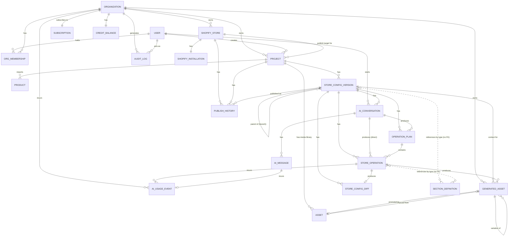

# Data Model

The conceptual and persisted data model backing Shopforge: every entity in the system, what it represents, how entities relate, and — where the source model specifies it — the field-level schema.

## Conventions

- Every entity's primary key is `id` (UUID) unless noted otherwise.
- `belongs_to` / `has_many` / `has_one` describe logical foreign-key relationships, not a specific ORM.
- JSON-typed columns store structures defined in their owning topic document — the Store Configuration shape ([Store Configuration](03-store-configuration.md)), section settings/blocks schemas ([Shared Section Contract](12-shared-section-contract.md)), operation types ([Visual Editor](09-visual-editor.md), [AI Architecture](04-ai-architecture.md)), and diff-entry shape ([Versioning and Undo/Redo](18-versioning-and-undo-redo.md)). This document does not redefine those shapes, only how they're persisted.
- Optimistic-lock fields (`lockVersion`) are declared on the relevant entity below; the compare-and-swap protocol that uses them is specified in [Versioning and Undo/Redo](18-versioning-and-undo-redo.md).
- **Database engine, exact column types beyond what's listed, and the schema-migration mechanism are TBD** — the source model specifies logical fields and relationships, not a specific database product or migration tooling. Do not assume a specific engine when implementing.
- Two similarly-named entities must not be confused: **`ShopifyStore`** is a connected merchant `myshopify.com` shop (an OAuth install target). **`Project`** is a Shopforge-generated store project — it can exist, be edited, and be fully AI-generated long before any `ShopifyStore` is connected. Field names spell out `shopifyStoreId` vs `storeId`/`projectId` accordingly.

## Entity groups

| Group | Entities |
|---|---|
| Identity & access | `User`, `Organization`, `OrgMembership` |
| Shopify connection | `ShopifyStore`, `ShopifyInstallation` |
| Store & product | `Project`, `Product` |
| Configuration & versioning | `StoreConfigVersion`, `StoreConfigDiff` |
| Section catalog | `SectionDefinition` |
| AI & generation | `AIConversation`, `AIMessage`, `OperationPlan`, `StoreOperation` |
| Assets | `Asset`, `GeneratedAsset` |
| Publishing | `PublishHistory` |
| Billing & usage | `Subscription`, `CreditBalance`, `AIUsageEvent` |
| Audit | `AuditLog` |

Four flow-diagram concepts — **Page**, **Section** (as placed in a store), **Block** (as placed in a section), and **Setting** (a value on a section or block) — are not separate persisted entities. They are addressable locations inside the single `configuration` JSON document owned by `StoreConfigVersion`. See [Concepts inside the Store Configuration document](#concepts-inside-the-store-configuration-document) below.

## Conceptual model

### Identity & access

**`User`** represents a human account, independent of any single Shopify shop or Organization — one person routinely belongs to multiple Organizations (e.g. an agency contractor), and an Organization's membership must outlive any one store connection. A `User` creates Projects, starts AIConversations, and acts as the actor on AuditLog entries.

**`Organization`** is the billing and access-control boundary. Agencies and teams manage multiple Shopify stores and multiple generated store Projects under one subscription and one shared set of role-based members — `Organization`, not the individual store, is what `Subscription` and `CreditBalance` attach to.

**`OrgMembership`** is the join entity carrying the role (`owner` / `admin` / `editor` / `viewer`) a `User` holds within an `Organization`. Shopforge's permission model is role-based per-organization, not global per-user; see [Security and Multi-Tenancy](21-security-and-multi-tenancy.md) for the role definitions.

### Shopify connection

**`ShopifyStore`** represents one connected Shopify shop (a `myshopify.com` domain) — the unit OAuth installation and Publish are scoped to. An Organization can connect several; a given `Project` links to at most one, and only once the user chooses to publish it.

**`ShopifyInstallation`** holds the OAuth access token/scopes for a `ShopifyStore`, including the status of the `write_themes` access-scope exemption that gates publishing (see [Shopify Publishing](14-shopify-publishing.md)). It is kept as a separate entity from `ShopifyStore` — not columns on it — so token material (which needs encryption-at-rest and tighter read access) is governed independently, and uninstall/reinstall cycles don't churn the store's own history.

### Store & product

**`Project`** represents one generated store project — the unit a product import, its AI-generated content, and its edit history are organized under. `Project` is distinct from `ShopifyStore` because the entire generation and editing flow (product import → AI generation → section selection/ordering/settings → visual editing) happens before any Shopify connection necessarily exists; a user can complete generation and manual editing without ever connecting a shop.

**`Product`** (a.k.a. Product Data) is the imported source-of-truth product data a Project is generated from — title, description, pricing, media, and variant structure pulled from the merchant-supplied product URL. `Product` is kept distinct from anything living in the Store Configuration: `Product` holds ground-truth imported facts, while a Store Configuration's section content (headlines, marketing copy, imagery choices) is AI-generated/rewritten presentation built *from* those facts. Conflating the two would make it impossible to tell "what did we actually import" from "what did the AI decide to say about it" — which matters for accuracy review and for re-running generation against the same source facts without re-scraping. See [Product Import](05-product-import.md).

There is no separate **`ProductImportJob`** entity. The import process — Product URL → Product Import/Scraper → normalized Product Data — is represented directly as state on `Product` itself: `importStatus` (`pending` → `importing` → `succeeded`/`partial`/`failed`), `importError`, and `importedFieldsMissing` capture the outcome of a best-effort scrape without a separate job table. Every content field on `Product` is nullable to allow the partial/failed states this implies.

### Configuration & versioning

**`StoreConfigVersion`** (the canonical entity behind "Store Configuration") is one checkpointed version of a Project's configuration — the mutable working-copy unit both the AI operation executor and the Visual Editor write through via the same unified mutation path. `configuration` is stored as a single JSON blob rather than normalized into per-section rows: this mirrors how the Store Configuration is defined and consumed everywhere else in the system (the LiquidJS Preview Renderer and the Shopify publish step both consume it as one document), version-level operations (checkpoint, branch, restore, publish) always act on the whole document, and `StoreConfigDiff` already provides path-level granularity for undo/redo without the storage layer itself needing to be normalized.

**`StoreConfigDiff`** is the reversible, human-readable record of what changed in a Store Configuration as the result of one AI operation or one manual edit. Storing the `before` value on every entry is what makes single-operation undo possible without a full version restore. Paths address locations inside the Store Configuration document (e.g. `pages.home.sections[2].settings.heading`), not theme file paths. See [Versioning and Undo/Redo](18-versioning-and-undo-redo.md).

### Section catalog

**`SectionDefinition`** is the queryable catalog entry for one member of the fixed Section Library — the Liquid sections Shopforge authors and maintains, never AI-generated. It is modeled as a database-backed reference table, not left purely as versioned code/config, because both the editor and the AI need to query "what section types exist, and what does each one's settings/blocks schema look like" at request time, and structural validation (does this Store Configuration reference a real section type with valid settings?) needs a fast, queryable source of truth. The Liquid template body itself is **not** duplicated into the database: `liquidTemplateRef` points at the file shipped in the application's own repository, so the template source stays under normal code review and version control — only the structured schema/metadata needed for runtime queries and validation lives in this table. See [Base Theme and Section Library](02-base-theme-and-section-library.md) and [Shared Section Contract](12-shared-section-contract.md).

### AI & generation

**`AIConversation`** groups a sequence of `AIMessage`s and the `OperationPlan`s/`StoreOperation`s they produce into one chat thread scoped to a `StoreConfigVersion`. `conversationType` distinguishes the initial whole-store generation pass (`initial_generation`: product import → first StoreConfigVersion) from later conversational editing turns (`editing`), since the two have different UI presentation and expected operation volume. There is no separate **`GenerationJob`** entity — the initial generation pass is represented the same way any AI-driven change is: as an `AIConversation` whose turns produce `OperationPlan`s and `StoreOperation`s. See [AI Architecture](04-ai-architecture.md).

**`AIMessage`** is one turn (user prompt or assistant response) within an `AIConversation`, kept separate from `OperationPlan`/`StoreOperation` because most messages don't produce an operation — clarifying questions, capability-gap explanations, and conversational replies are all messages without one.

**`OperationPlan`** is the persisted form of an ordered set of AI Operations with rationale and an overall risk summary, generated before any non-trivial execution. Persisting it as its own entity — rather than embedding it on `AIConversation` — is what lets a user review/approve/reject the plan as one unit, and lets one conversation produce several plans across turns.

**`StoreOperation`** is the persisted form of an AI Operation or an editor operation, after it has been proposed or applied — the audit trail of exactly which change was requested against a Store Configuration, used for undo, per-operation cost accounting, and plan-progress tracking. It is kept distinct from `StoreConfigDiff`: `StoreOperation` is the *intent* (what was requested), `StoreConfigDiff` is the *effect* (what actually changed) — an operation can fail before producing a diff, and a diff can also originate from a direct editor edit that was never modeled as an operation.

### Assets

**`Asset`** is the canonical, queryable record of a Project's media-library asset (image, font, other), referenced by URL from settings values inside a Store Configuration rather than by file path — there is no theme file tree in this architecture for an asset to live inside. It is a separate table (not just an in-config URL string) because the asset library UI, dedup-by-checksum, and storage-size accounting all need to query assets independently of loading any one Store Configuration version, and the same uploaded/generated asset is commonly reused across several sections and several versions of the same Project. See [Assets](13-assets.md).

**`GeneratedAsset`** tracks AI-generated media (image or copy) with its generation provenance — prompt, model, source operation — separately from `Asset`. This keeps unaccepted/discarded generation attempts and regeneration variations out of the Project's canonical asset library; a `GeneratedAsset` is promoted to an `Asset` row only once accepted.

### Publishing

**`PublishHistory`** (a.k.a. Publish Record) is the audit and rollback record of every time a `StoreConfigVersion` was pushed onto the merchant's installed Base Theme in Shopify. `action` distinguishes the first publish for a Project (which must install the Base Theme instance before applying anything) from later republishes (which reuse the already-installed theme). This is what answers "what's live right now, and what was live before," and backs rollback. See [Shopify Publishing](14-shopify-publishing.md).

### Billing & usage

**`Subscription`** is the billing plan an Organization is subscribed to — tier, monthly credit allotment, price. It is modeled as one entity with a `planTier` field, not a separate `Plan` definitions table plus a `Subscription` join — no requirement in scope needs plan definitions to version independently of the organization's current subscription record.

**`CreditBalance`** is the Organization's current spendable AI-credit balance — a mutable running total kept separate from `AIUsageEvent` (the immutable ledger) so a pre-flight "does this org have enough credit to run this operation" check is an O(1) row read instead of a `SUM()` over the ledger on every AI action.

**`AIUsageEvent`** is an immutable credit-ledger line item for every billable AI action (store generation, chat completion, plan generation, operation execution, image/copy generation). It is append-only, never edited in place, so invoices and disputes have a source of truth independent of the mutable `CreditBalance` total.

### Audit

**`AuditLog`** is a generic, append-only security/compliance trail of sensitive actions across the whole system (auth events, role changes, OAuth install/uninstall, publishes, destructive operations), independent of any single domain table — needed because imported product data and scraped source pages are untrusted input, and for incident investigation.

### Concepts inside the Store Configuration document

**Page**, **Section** (an instance placed in a page), **Block** (an instance placed in a section), and **Setting** (a value on a section or block) are not persisted as separate database rows. They are addressable locations inside the single `configuration` JSON document stored on `StoreConfigVersion`, in the shape `pages -> sections[] -> {id, type, settings, blocks}` (see [Store Configuration](03-store-configuration.md)). AI operations, editor operations, and the LiquidJS renderer all address these same JSON paths (e.g. `pages.home.sections[2].settings.heading`) rather than normalized foreign keys, and `StoreConfigDiff` entries carry this same path addressing — giving path-level undo/redo granularity without the storage layer itself needing to be normalized into per-row tables.

`SectionDefinition` (the catalog entry) is referenced from `configuration` and from `StoreOperation.payload` by its `type` string — a logical, not a hard foreign-key, relationship, since the configuration document is JSON.

**`PreviewSession`** is not modeled as a persisted entity in the source model. Live-editing-session preview rendering is a request/response against the current `StoreConfigVersion`'s `configuration`, not a stateful entity with its own identity; see [Open questions](#open-questions--tbd) for the unresolved client-side/server-side execution placement.

### Relationship diagram

## Persisted schema

Field-level schema for every entity above that is backed by its own database table. Types are logical (`uuid`, `string`, `text`, `decimal`, `integer`, `boolean`, `timestamp`, `json`, `enum(...)`); the concrete column types are an implementation detail of the (TBD) database engine.

### User

| Field | Type | Notes |
|---|---|---|
| id | uuid (pk) | |
| email | string | |
| name | string | |
| passwordHash | string, nullable | null when auth is via external OAuth provider only |
| authProvider | enum(`email`,`google`,`shopify`) | |
| avatarUrl | string, nullable | |
| createdAt | timestamp | |
| updatedAt | timestamp | |
| lastLoginAt | timestamp, nullable | |

**Relationships:** `has_many` OrgMembership; `has_many` Organization (through OrgMembership); `has_many` Project (as creator); `has_many` AIConversation (as initiator); `has_many` AuditLog (as actor).

**Constraints:** unique(`email`).

### Organization

| Field | Type | Notes |
|---|---|---|
| id | uuid (pk) | |
| name | string | |
| slug | string | url-safe, used in routing |
| ownerUserId | uuid (fk User) | denormalized pointer to the member with role=`owner`, for O(1) lookup |
| status | enum(`active`,`trial`,`suspended`) | |
| createdAt | timestamp | |
| updatedAt | timestamp | |

**Relationships:** `has_many` OrgMembership, ShopifyStore, Project, AIUsageEvent, AuditLog, GeneratedAsset; `has_one` Subscription, CreditBalance.

**Constraints:** unique(`slug`).

### OrgMembership

| Field | Type | Notes |
|---|---|---|
| id | uuid (pk) | |
| organizationId | uuid (fk Organization) | |
| userId | uuid (fk User) | |
| role | enum(`owner`,`admin`,`editor`,`viewer`) | see [Security and Multi-Tenancy](21-security-and-multi-tenancy.md) |
| status | enum(`active`,`invited`,`revoked`) | |
| invitedByUserId | uuid (fk User), nullable | |
| createdAt | timestamp | |
| updatedAt | timestamp | |

**Relationships:** `belongs_to` Organization, User.

**Constraints:** unique(`organizationId`, `userId`) — a user holds exactly one role per org. Exactly one `active` membership with role=`owner` per Organization is enforced at the application layer (ownership transfer is a transaction, never a gap).

### ShopifyStore

| Field | Type | Notes |
|---|---|---|
| id | uuid (pk) | |
| organizationId | uuid (fk Organization) | |
| shopDomain | string | e.g. `foo.myshopify.com` |
| shopifyShopId | string | Shopify's own shop id/GID |
| planName | string, nullable | Shopify's merchant plan, informational only |
| currency | string | |
| timezone | string | |
| status | enum(`active`,`disconnected`,`uninstalled`) | |
| connectedAt | timestamp | |

**Relationships:** `belongs_to` Organization; `has_one` ShopifyInstallation; `has_many` Project (generated stores published or targeted at this shop), PublishHistory.

**Constraints:** unique(`shopDomain`).

### ShopifyInstallation

| Field | Type | Notes |
|---|---|---|
| id | uuid (pk) | |
| shopifyStoreId | uuid (fk ShopifyStore) | |
| accessToken | string, encrypted at rest | |
| scopes | string[] | |
| apiVersion | string | Shopify Admin API version pinned at install time |
| writeThemesExemptionStatus | enum(`not_requested`,`pending`,`granted`,`denied`) | required before any theme-create/theme-files-upsert/theme-publish call — see [Shopify Publishing](14-shopify-publishing.md) |
| webhookIds | string[] | registered webhook subscription ids |
| isActive | boolean | |
| installedAt | timestamp | |
| uninstalledAt | timestamp, nullable | |

**Relationships:** `belongs_to` ShopifyStore (1:1).

**Constraints:** unique(`shopifyStoreId`).

### Product

| Field | Type | Notes |
|---|---|---|
| id | uuid (pk) | |
| projectId | uuid (fk Project) | |
| sourceUrl | string | the merchant-provided product page URL |
| sourcePlatform | enum(`shopify`,`woocommerce`,`bigcommerce`,`amazon`,`generic_html`,`unknown`), nullable | detected during scraping, informs which extraction strategy ran |
| importStatus | enum(`pending`,`importing`,`succeeded`,`partial`,`failed`) | |
| importError | text, nullable | failure reason when `failed`; warning summary when `partial` |
| importedFieldsMissing | string[], nullable | e.g. `["variants","brand"]` — populated when `importStatus = partial` |
| title | string, nullable | null until import completes |
| description | text, nullable | raw scraped description, pre-AI-rewrite |
| price | decimal, nullable | |
| compareAtPrice | decimal, nullable | |
| currency | string, nullable | |
| brand | string, nullable | |
| category | string, nullable | |
| images | json, nullable | `[{ url, altText, position }]` |
| variants | json, nullable | `[{ title, sku, price, options }]` |
| options | json, nullable | `[{ name, values[] }]` |
| availability | enum(`in_stock`,`out_of_stock`,`unknown`), nullable | not all source sites expose this |
| rawScrapedHtmlUrl | string, nullable | storage pointer to the fetched page, kept for re-processing/debugging without re-hitting the source URL |
| importedAt | timestamp, nullable | |
| createdAt | timestamp | |
| updatedAt | timestamp | |

**Relationships:** `belongs_to` Project.

**Constraints:** index(`projectId`); index(`importStatus`). MVP generation is built around one primary Product per Project, but the relationship is one-to-many to allow future multi-product stores without a schema change.

### Project

| Field | Type | Notes |
|---|---|---|
| id | uuid (pk) | |
| organizationId | uuid (fk Organization) | |
| createdByUserId | uuid (fk User) | |
| name | string | user-facing project name, editable |
| status | enum(`generating`,`draft`,`editing`,`published`,`archived`) | |
| currentStoreConfigVersionId | uuid (fk StoreConfigVersion), nullable | the active working (draft) version |
| publishedStoreConfigVersionId | uuid (fk StoreConfigVersion), nullable | the version currently live on Shopify, if any |
| shopifyStoreId | uuid (fk ShopifyStore), nullable | set on first publish |
| installedThemeShopifyId | string, nullable | Shopify's theme id/GID for the Base Theme instance in that shop, set by the first theme-create call |
| createdAt | timestamp | |
| updatedAt | timestamp | |

**Relationships:** `belongs_to` Organization, User (creator), ShopifyStore (nullable, once published); `has_many` Product, StoreConfigVersion, Asset (its media library), PublishHistory.

**Constraints:** index(`organizationId`, `status`); index(`shopifyStoreId`).

### StoreConfigVersion

| Field | Type | Notes |
|---|---|---|
| id | uuid (pk) | |
| projectId | uuid (fk Project) | |
| parentStoreConfigVersionId | uuid (fk StoreConfigVersion), nullable | self-referential, branch lineage |
| label | string | e.g. "v3", "AI generation Aug 20" |
| status | enum(`draft`,`active`,`published`,`archived`) | |
| configuration | json | Store Configuration shape: `{ pages: { [pageId]: { sections: [{ id, type, settings, blocks }] } } }` |
| configHash | string | content hash, cache/dedup key |
| lockVersion | integer, default 0 | optimistic-concurrency counter — protocol in [Versioning and Undo/Redo](18-versioning-and-undo-redo.md) |
| producedByType | enum(`ai_generation`,`ai_operation`,`editor_edit`,`restore`) | how this checkpoint came to exist |
| producedByOperationId | uuid (fk StoreOperation), nullable | set when `producedByType` is `ai_operation` or `editor_edit` and one specific operation produced this checkpoint |
| producedByUserId | uuid (fk User), nullable | |
| createdAt | timestamp | |
| publishedAt | timestamp, nullable | |
| updatedAt | timestamp | |

**Relationships:** `belongs_to` Project, StoreConfigVersion (parent, self-referential); `has_many` StoreOperation, OperationPlan, StoreConfigDiff, AIConversation, GeneratedAsset, PublishHistory (as the version that was published).

**Constraints:**
- index(`projectId`, `status`)
- unique partial index on `projectId` WHERE `status = 'active'` — exactly one active StoreConfigVersion per Project
- index(`configHash`) for dedup/cache lookups
- index(`lockVersion`) is implicit in the compare-and-swap update clause used by every mutation

### SectionDefinition

| Field | Type | Notes |
|---|---|---|
| id | uuid (pk) | |
| type | string | unique machine key, e.g. `hero-banner` — the value stored in `configuration.pages[*].sections[*].type` |
| category | enum(`hero`,`product`,`collection`,`testimonial`,`header`,`footer`,`content`,`other`) | |
| name | string | display name shown in the editor's section picker |
| description | string | |
| schemaVersion | integer | bumped whenever `settingsSchema`/`blocksSchema` changes in a non-backward-compatible way |
| settingsSchema | json | available settings, their types, defaults, validation rules |
| blocksSchema | json, nullable | block types this section accepts, if any |
| liquidTemplateRef | string | path/identifier of the Liquid template in the application's codebase, e.g. `sections/hero-banner.liquid` |
| thumbnailUrl | string, nullable | preview thumbnail shown in the section picker |
| status | enum(`active`,`deprecated`) | deprecated types remain queryable (for stores already using them) but are hidden from the picker |
| createdAt | timestamp | |
| updatedAt | timestamp | |

**Relationships:** referenced by `type` string from `StoreConfigVersion.configuration` and `StoreOperation.payload` — a logical, not a hard foreign-key, relationship, since the configuration document is JSON.

**Constraints:** unique(`type`); index(`status`, `category`).

### StoreOperation

| Field | Type | Notes |
|---|---|---|
| id (opId) | uuid (pk) | |
| storeConfigVersionId | uuid (fk StoreConfigVersion) | |
| operationPlanId | uuid (fk OperationPlan), nullable | null for direct (non-planned) editor-triggered ops |
| aiConversationId | uuid (fk AIConversation), nullable | |
| operationType | enum | `add_section`, `remove_section`, `reorder_section`, `duplicate_section`, `add_block`, `remove_block`, `reorder_block`, `set_setting`, `set_block_setting`, `set_content`, `set_global_style`, `generate_copy`, `generate_image`, `regenerate_section`, `regenerate_page` — see [Visual Editor](09-visual-editor.md) and [AI Architecture](04-ai-architecture.md). `set_content` targets copy/text fields specifically (distinct from `set_setting`'s structural/style fields) because content edits are also what `generate_copy` writes, and usage analytics track them separately |
| target | json | `{ pageId?, sectionId?, blockId?, settingPath? }` |
| payload | json | shape depends on `operationType` |
| requiresAIGeneration | boolean | true for `generate_copy`, `generate_image`, `regenerate_section`, `regenerate_page` |
| riskLevel | enum(`safe`,`review`,`destructive`) | |
| estimatedCreditCost | decimal | |
| actualCreditCost | decimal, nullable | set once executed |
| status | enum(`pending`,`executing`,`applied`,`failed`,`reverted`) | |
| executedByUserId | uuid (fk User), nullable | set for editor-originated ops |
| createdAt | timestamp | |
| appliedAt | timestamp, nullable | |
| revertedAt | timestamp, nullable | |

**Relationships:** `belongs_to` StoreConfigVersion, OperationPlan (nullable), AIConversation (nullable); `has_one` StoreConfigDiff; `has_many` AIUsageEvent, GeneratedAsset (produced).

**Constraints:** index(`storeConfigVersionId`, `createdAt`); index(`operationPlanId`).

### OperationPlan

| Field | Type | Notes |
|---|---|---|
| id | uuid (pk) | |
| storeConfigVersionId | uuid (fk StoreConfigVersion) | |
| aiConversationId | uuid (fk AIConversation) | |
| rationale | text | natural-language overall summary |
| overallRiskLevel | enum(`safe`,`review`,`destructive`) | |
| estimatedTotalCreditCost | decimal | |
| status | enum(`proposed`,`approved`,`rejected`,`partially_executed`,`executed`,`expired`) | |
| respondedByUserId | uuid (fk User), nullable | |
| respondedAt | timestamp, nullable | |
| createdAt | timestamp | |

**Relationships:** `belongs_to` StoreConfigVersion, AIConversation; `has_many` StoreOperation (ordered).

**Constraints:** index(`storeConfigVersionId`, `status`); index(`aiConversationId`).

### StoreConfigDiff

| Field | Type | Notes |
|---|---|---|
| id (diffId) | uuid (pk) | |
| storeConfigVersionId | uuid (fk StoreConfigVersion) | |
| causedByType | enum(`ai_operation`,`editor_edit`) | |
| causedByOperationId | uuid (fk StoreOperation), nullable | set when `causedByType = ai_operation` |
| causedByUserId | uuid (fk User), nullable | |
| entries | json (`DiffEntry[]`) | `{ kind, path, before?, after?, humanSummary }` |
| createdAt | timestamp | |

**Relationships:** `belongs_to` StoreConfigVersion, StoreOperation (nullable), User (nullable).

**Constraints:** index(`storeConfigVersionId`, `createdAt`) — the chronological undo stack for a version.

### AIConversation

| Field | Type | Notes |
|---|---|---|
| id | uuid (pk) | |
| storeConfigVersionId | uuid (fk StoreConfigVersion) | |
| userId | uuid (fk User) | who started it |
| conversationType | enum(`initial_generation`,`editing`) | |
| title | string | auto-summarized or user-set |
| status | enum(`active`,`archived`) | |
| lastMessageAt | timestamp | |
| createdAt | timestamp | |
| updatedAt | timestamp | |

**Relationships:** `belongs_to` StoreConfigVersion, User; `has_many` AIMessage, OperationPlan, StoreOperation (direct, non-planned).

**Constraints:** index(`storeConfigVersionId`, `updatedAt` desc).

### AIMessage

| Field | Type | Notes |
|---|---|---|
| id | uuid (pk) | |
| aiConversationId | uuid (fk AIConversation) | |
| role | enum(`user`,`assistant`,`system`) | |
| content | text | markdown-capable |
| attachments | json, nullable | e.g. referenced image URLs |
| relatedOperationPlanId | uuid (fk OperationPlan), nullable | |
| relatedAIUsageEventId | uuid (fk AIUsageEvent), nullable | |
| createdAt | timestamp | |

**Relationships:** `belongs_to` AIConversation, OperationPlan (nullable); `has_one` AIUsageEvent (nullable).

**Constraints:** index(`aiConversationId`, `createdAt`).

### AIUsageEvent

| Field | Type | Notes |
|---|---|---|
| id | uuid (pk) | |
| organizationId | uuid (fk Organization) | |
| projectId | uuid (fk Project), nullable | |
| storeConfigVersionId | uuid (fk StoreConfigVersion), nullable | |
| aiConversationId | uuid (fk AIConversation), nullable | |
| aiMessageId | uuid (fk AIMessage), nullable | |
| operationId | uuid (fk StoreOperation), nullable | |
| eventType | enum(`chat_message`,`store_generation`,`plan_generation`,`operation_execution`,`generate_image`,`generate_copy`,`analyze`) | |
| creditsCost | decimal | |
| tokensInput | integer, nullable | |
| tokensOutput | integer, nullable | |
| modelUsed | string, nullable | |
| createdAt | timestamp | |

**Relationships:** `belongs_to` Organization; `belongs_to` Project / StoreConfigVersion / AIConversation / AIMessage / StoreOperation (all nullable, whichever triggered it).

**Constraints:** index(`organizationId`, `createdAt`) — billing-period rollups; index(`eventType`).

### GeneratedAsset

| Field | Type | Notes |
|---|---|---|
| id | uuid (pk) | |
| organizationId | uuid (fk Organization) | |
| storeConfigVersionId | uuid (fk StoreConfigVersion), nullable | |
| operationId | uuid (fk StoreOperation), nullable | |
| sourceGeneratedAssetId | uuid (fk GeneratedAsset), nullable | self-ref, for regenerate/variation chains |
| assetId | uuid (fk Asset), nullable | set once promoted into the Project's media library |
| type | enum(`image`,`copy`) | |
| prompt | text | |
| modelUsed | string | |
| status | enum(`generated`,`accepted`,`discarded`) | |
| createdByUserId | uuid (fk User) | |
| createdAt | timestamp | |

**Relationships:** `belongs_to` Organization; `belongs_to` StoreConfigVersion (nullable), StoreOperation (nullable), Asset (nullable, once promoted), GeneratedAsset (nullable, variation lineage).

**Constraints:** index(`storeConfigVersionId`, `createdAt`).

### Asset

| Field | Type | Notes |
|---|---|---|
| id | uuid (pk) | |
| projectId | uuid (fk Project) | |
| type | enum(`image`,`font`,`other`) | |
| url | string | storage location — the value referenced from `configuration` settings |
| sizeBytes | integer | |
| uploadedBy | enum(`user`,`ai`) | |
| sourceGeneratedAssetId | uuid (fk GeneratedAsset), nullable | |
| checksum | string | |
| createdAt | timestamp | |
| updatedAt | timestamp | |

**Relationships:** `belongs_to` Project, GeneratedAsset (nullable).

**Constraints:** unique(`projectId`, `checksum`) for dedup.

**Final storage provider for assets: TBD** — not specified by the source model.

### PublishHistory

| Field | Type | Notes |
|---|---|---|
| id | uuid (pk) | |
| shopifyStoreId | uuid (fk ShopifyStore) | |
| projectId | uuid (fk Project) | |
| storeConfigVersionId | uuid (fk StoreConfigVersion) | the version published |
| previousStoreConfigVersionId | uuid (fk StoreConfigVersion), nullable | rollback target reference |
| shopifyThemeId | string | Shopify's theme id/GID for the installed Base Theme instance |
| action | enum(`install_and_publish`,`update_and_publish`,`rollback`) | |
| status | enum(`pending`,`success`,`failed`) | |
| publishedByUserId | uuid (fk User) | |
| startedAt | timestamp | |
| completedAt | timestamp, nullable | |
| errorMessage | string, nullable | |

**Relationships:** `belongs_to` ShopifyStore, Project, StoreConfigVersion (published, and previous).

**Constraints:** index(`shopifyStoreId`, `startedAt` desc); index(`projectId`, `startedAt` desc).

### Subscription

| Field | Type | Notes |
|---|---|---|
| id | uuid (pk) | |
| organizationId | uuid (fk Organization) | |
| planTier | enum(`free`,`starter`,`pro`,`agency`) | |
| status | enum(`active`,`past_due`,`canceled`,`trialing`) | |
| monthlyCreditAllotment | integer | |
| pricePerMonth | decimal | |
| billingProvider | string | e.g. `stripe` |
| billingProviderCustomerId | string | |
| billingProviderSubscriptionId | string | |
| currentPeriodStart | timestamp | |
| currentPeriodEnd | timestamp | |
| cancelAtPeriodEnd | boolean | |
| createdAt | timestamp | |
| updatedAt | timestamp | |

**Relationships:** `belongs_to` Organization (1:1).

**Constraints:** unique(`organizationId`) — one subscription record per org; historical plan changes are tracked via billing-provider events/webhooks, not new rows. Full tiered billing is deferred post-MVP; see [MVP Scope](24-mvp-scope.md).

### CreditBalance

| Field | Type | Notes |
|---|---|---|
| id | uuid (pk) | |
| organizationId | uuid (fk Organization) | |
| currentBalance | decimal | |
| lifetimeGranted | decimal | |
| lifetimeConsumed | decimal | |
| lastReplenishedAt | timestamp, nullable | |
| lastConsumedAt | timestamp, nullable | |
| updatedAt | timestamp | |

**Relationships:** `belongs_to` Organization (1:1).

**Constraints:** unique(`organizationId`). `currentBalance` is updated transactionally alongside the `AIUsageEvent` insert that consumes it.

### AuditLog

| Field | Type | Notes |
|---|---|---|
| id | uuid (pk) | |
| organizationId | uuid (fk Organization), nullable | null for platform-level events |
| actorUserId | uuid (fk User), nullable | null for system/AI actions |
| actorType | enum(`user`,`system`,`ai`) | |
| action | string | e.g. `org.member.role_changed`, `shopify.oauth.connected`, `store.published` |
| targetType | string | e.g. `ShopifyStore`, `Project` |
| targetId | string | |
| metadata | json | |
| ipAddress | string, nullable | |
| createdAt | timestamp | |

**Relationships:** `belongs_to` Organization (nullable), User (nullable, actor).

**Constraints:** index(`organizationId`, `createdAt` desc); index(`actorUserId`, `createdAt` desc); index(`targetType`, `targetId`).

## Entity-separation decisions

These are settled; see [DECISIONS.md](DECISIONS.md) for the cross-referenced list.

| Kept separate | Why |
|---|---|
| `GeneratedAsset` vs. `Asset` | `Asset` has a `unique(projectId, checksum)` constraint — it represents one accepted media item in a Project's library. A single generation request can produce several candidate images before one is accepted, and discarded generations must never appear in asset-library queries. |
| `Project` vs. `StoreConfigVersion` | `Project` is the stable identity and publish-target pointer (current/published version pointers, `shopifyStoreId` once connected); `StoreConfigVersion` is the append-only checkpoint history. Folding versions into `Project` would either lose history or make `Project` rows grow unbounded. |
| `SectionDefinition` as a DB-backed catalog, not pure code/config | The editor and the AI both need runtime queries the codebase can't serve efficiently per-request, and structural validation needs the same fast lookup. The Liquid template source itself is not duplicated into the row. |
| `StoreOperation` vs. `StoreConfigDiff` | Requested intent vs. realized effect. An operation can be `pending`/`failed` without ever producing a diff; a diff can exist from a manual editor edit that was never modeled as a `StoreOperation` at all. |
| `Product` vs. Store Configuration content | `Product` is imported ground truth; a Store Configuration's section settings/content are AI-authored presentation derived from it. Merging them would erase the ability to tell what was actually scraped from what the AI decided to say. |
| `Subscription` as one entity, not `Plan` + `Subscription` | The concept is one billing record referred to by two common terms, not two entities. A separate `Plan` definitions table is a reasonable future normalization if plan definitions need independent versioning, but nothing in current scope requires it. |

No entity is redundant: each maps to a distinct read/write access pattern or a distinct lifecycle (proposal vs. execution, ledger vs. balance, intent vs. effect, imported fact vs. generated presentation, working copy vs. published copy).

## Open Questions / TBD

- **Database engine and schema-migration mechanism** — not specified by the source model. Do not assume a specific product (e.g. a specific relational database) or migration tool when implementing.
- **Final storage provider for assets** (`Asset.url`, `Product.rawScrapedHtmlUrl`, `GeneratedAsset` outputs) — not decided.
- **Client-side vs. server-side LiquidJS execution for the live-editing preview.** A per-section server-rendered fragment is assumed for share-link/thumbnail rendering only; where live-editing-session rendering runs — and whether it warrants its own persisted `PreviewSession`-style state — is unresolved.
- **Section settings-schema migration path** across Base Theme versions for already-published stores, once a `SectionDefinition.schemaVersion` bump is non-backward-compatible.
- **Base Theme update policy** for already-published stores (auto-update vs. opt-in) — affects how `Project.installedThemeShopifyId` and future publishes interact.
- **Exact packaging/hosting/versioning of the Base Theme's install-time source artifact** that `SectionDefinition.liquidTemplateRef` and `Project.installedThemeShopifyId` ultimately depend on.
- **`write_themes` exemption approval criteria/timeline** — `ShopifyInstallation.writeThemesExemptionStatus` models the state machine (`not_requested` / `pending` / `granted` / `denied`), but the approval process itself is external and unresolved.
